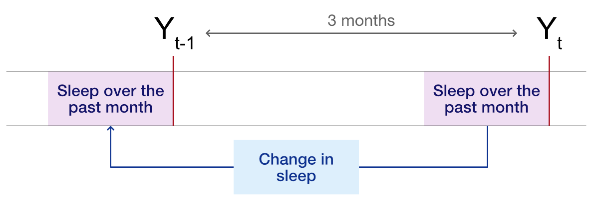
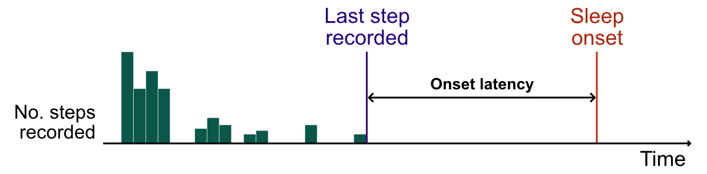

\clearpage


::: {.cell}

:::


# Measures

## Derivation of sleep features

We considered 13 sleep features organised into three domains:

| Domain           | Feature                                 | Definition                                                                                                                                                                                              | Derivation of sleep feature                                                                                                                                                                                                                                                                                 |
|------------------|-----------------------------------------|---------------------------------------------------------------------------------------------------------------------------------------------------------------------------------------------------------|-------------------------------------------------------------------------------------------------------------------------------------------------------------------------------------------------------------------------------------------------------------------------------------------------------------|
| Sleep duration   | Total sleep time^†^                     | Median daily hours spent asleep.                                                                                                                                                                        | The sum of all 'non-awake' Fitbit sleep stages (i.e., light, deep, and REM).                                                                                                                                                                                                                                |
|                  | Change in total sleep time^‡^           | Difference in median daily hours spent asleep over the four weeks before the current outcome assessment (T~2~) versus the four weeks before to the previous outcome assessment three months ago (T~1~). | As above.                                                                                                                                                                                                                                                                                                   |
|                  | Total sleep time, variance^†^           | Intra-individual variance in median daily hours spent asleep.                                                                                                                                           | As above.                                                                                                                                                                                                                                                                                                   |
|                  | Change in total sleep time, variance^‡^ | Difference in intra-individual variance in median daily hours asleep from T~2~ to T~1~.                                                                                                                 | As above.                                                                                                                                                                                                                                                                                                   |
| Sleep quality    | Sleep efficiency^†^                     | Median hours spent asleep as a proportion of hours spent in bed per day.                                                                                                                                | Hours spent asleep calculated as above ('total sleep time'). Hours spent in bed calculated as interval between 'sleep onset' (the start of the first 'non-awake' stage of the current sleep event) and 'sleep offset' (the end of the last 'non-awake' stage).                                              |
|                  | Sleep fragmentation index^†^            | Median daily number of awakenings divided by the hours spent asleep.                                                                                                                                    | The number of awakenings was calculated as the number of times (during each sleep event) that the participant was awake (i.e., not in one of the four sleep stages) for more than five minutes.                                                                                                             |
|                  | Sleep onset latency^†^                  | Median time between last recorded step taken and Fitbit-derived sleep onset each day.                                                                                                                   | Sleep onset was derived as the clock time of the first non-awake sleep stage for a given sleep event. The timing of the 'last recorded step' is defined below.                                                                                                                                              |
|                  | Sleep onset latency variance^†^         | Intra-individual variance in median sleep onset.                                                                                                                                                        | As above.                                                                                                                                                                                                                                                                                                   |
| Sleep regularity | Sleep midpoint^†^                       | Median midpoint between sleep onset and sleep offset.                                                                                                                                                   | For each sleep event , sleep onset was derived as the clock time of the start of the first 'non-awake' stage. Sleep offset was similarly derived as the end of the last 'non-awake' stage. Both onset and offset were centred around midnight, such that 0 represented midnight and -12 represented midday. |
|                  | Sleep midpoint, variance^†^             | Intra-individual variance in median sleep midpoint.                                                                                                                                                     | As above.                                                                                                                                                                                                                                                                                                   |
|                  | Change in sleep midpoint^‡^             | Difference in median sleep midpoint from T~2~ to T~1~.                                                                                                                                                  | As above.                                                                                                                                                                                                                                                                                                   |
|                  | Change in sleep midpoint variance^‡^    | Difference in intra-individual variance in median sleep midpoint from T~2~ to T~1~.                                                                                                                     | As above.                                                                                                                                                                                                                                                                                                   |
|                  | Social jet lag^†^                       | Absolute difference between weekday and weekend sleep midpoints.                                                                                                                                        | As above.                                                                                                                                                                                                                                                                                                   |

^†^ Measured over the four weeks prior to each outcome assessment.\
^‡^ Measured as the change between the four weeks before the current
outcome assessment (T~2~) and the four weeks before the previous outcome
assessment three months ago (T~1~)

Each sleep feature was derived using information collected in the four
weeks prior to each 3-monthly outcome assessment. For features measuring
a change in sleep (e.g., Δ total sleep time), we calculated the
difference between sleep over the past 4 weeks and sleep in the same
period at the previous outcome assessment:

{fig-align="center"}

### Derivation of daily sleep features

The included sleep features are described in the table above. These
features have previously been defined by Zhang et al., [-@zhang2021] in
an existing analysis of RADAR-MDD.

Sleep parameters were continuously recorded by Fitbit devices. From this
information, we derived aggregate daily summaries for each participant
during follow-up.

On most days, participants had a single 'sleep event' (i.e., an episode
of sleep starting with 'sleep onset' and ending with 'sleep offset').
However, on around 10% of days participants recorded multiple sleep
events. On those days, we used information for the primary sleep event
only, identified as the largest continuous sleep event. Shorter sleep
events (e.g., naps) were discarded.

Almost all sleep features were derived directly from the daily Fitbit
data (e.g., total hours of sleep). One feature, **onset latency**,
required further processing:

**Onset latency** refers to the time between going to bed and falling
asleep (sleep onset). Since 'time of going to bed' was not provided by
Fitbit, we instead derived this information by combining information
from Fitbit on sleep and physical activity. Specifically, we defined
onset latency as the period between the last step recorded (based on
physical activity information provided by Fitbit) and the onset of sleep
(defined in the table above). This is illustrated below:

{fig-align="center"}

### Derivation of sleep features in the four weeks before each outcome assessment

From the daily aggregate measures, we derived sleep features summarising
sleep over the four weeks prior to each 3-monthly outcome assessment.
Each feature represented the median or variance of the available daily
values.

At each 3-monthly assessment, we included participants who provided
sleep information on at least 8 (non-consecutive) days over the previous
four weeks. We chose a minimum of 8 days to provide reliable summaries
whilst minimising selection bias (participants wearing their Fitbit for
more than eight days tended to have lower depressive symptoms and more
stable sleep patterns).

## Covariates

We considered four covariates measured at enrolment:

-   Male gender (0/1);
-   Partnership status (0/1);
-   Years of age (continuous);
-   Years of education (continuous).

And four covariates measured repeatedly at each three-monthly outcome
assessment:

-   Atypical depression subtype;
-   Current medication use;
-   Alcohol use;
-   Hours of daylight;

### Atypical depression

Following @novick2005, we defined 'atypical depression' based on
consensus-selected items of the IDS-SR (Inventory of Depressive
Symptomatology Self-Report). To be classified as atypical, participants
needed to report (1) a score of 0-2 for 'mood reactivity'; *and* (2) at
least two of the following symptoms:

1.  Leaden paralysis (a score of 2-3);
2.  Weight gain *or* increased appetite (a score of 2-3);
3.  Hypersomnia (a score of 2-3);
4.  Interpersonal sensitivity (a score of 3).

### Current medication use

At enrolment and each 3-monthly assessment, participants were asked to
list medication they were currently taking as part of the Client Service
Receipt Inventory (CSRI).

After correcting typographical errors, we categorised each medication
based on expert opinion into three categories:

1.  **Depression-related**
    -   Antidepressants
    -   Antipsychotics
    -   Anticonvulsants
2.  **Sleep-related**
    -   Benzodiazepines
    -   Hypnotics
3.  **Other**

These were entered into the models as three binary variables (0/1)
indicating whether the participant was currently using each type of
medication.

### Alcohol use

Alcohol use was measured using the total score on the Alcohol Use
Disorders Identification Test (AUDIT).

### Hours of daylight

To account for seasonal differences in sleep and mood, we adjusted for
the mean hours of sunshine in the four weeks before each three-monthly
outcome assessment.

Information from the World Meteorological Organization (WMO) was
extracted from UNdata[^1] for three cities corresponding to the three
RADAR-MDD sites:

[^1]: <http://data.un.org/Data.aspx?d=CLINO&f=ElementCode%3a15>

| WMO city                                | RADAR-MDD site        |
|:----------------------------------------|:----------------------|
| De Bilt, Utrecht, The Netherlands.      | Amsterdam             |
| London Gatwick, London, United Kingdom. | King's College London |
| Madrid, Spain                           | CIBER Madrid          |

WMO define hours of sunshine as the period during which direct solar
irradiance exceeds 120 watts per square meter. This value is equivalent
to the level of solar irradiance shortly after sunrise or shortly before
sunset in cloud-free conditions.

# Computing

## Software

All analyses were conducted in R 4.2.3. The main packages used were:

-   [`brms`](https://CRAN.R-project.org/package=brms) 2.18;

-   [`cmdstanr`](https://mc-stan.org/cmdstanr/) 0.5.3, using
    [CmdStan](https://mc-stan.org/users/interfaces/cmdstan) 2.32.0;

-   [`tidyverse`](https://CRAN.R-project.org/package=tidyverse) 2.0.0;

-   [`marginaleffects`](https://CRAN.R-project.org/package=marginaleffects)
    0.11.1.

A full list of packages is provided in the `renv.lock` file.

## Session information


::: {.cell}

```{.r .cell-code}
sessionInfo()
```

::: {.cell-output .cell-output-stdout}
```
R version 4.3.2 (2023-10-31)
Platform: x86_64-pc-linux-gnu (64-bit)
Running under: Ubuntu 22.04.3 LTS

Matrix products: default
BLAS:   /usr/lib/x86_64-linux-gnu/blas/libblas.so.3.10.0 
LAPACK: /usr/lib/x86_64-linux-gnu/lapack/liblapack.so.3.10.0

locale:
 [1] LC_CTYPE=en_GB.UTF-8       LC_NUMERIC=C              
 [3] LC_TIME=en_GB.UTF-8        LC_COLLATE=en_GB.UTF-8    
 [5] LC_MONETARY=en_GB.UTF-8    LC_MESSAGES=en_GB.UTF-8   
 [7] LC_PAPER=en_GB.UTF-8       LC_NAME=C                 
 [9] LC_ADDRESS=C               LC_TELEPHONE=C            
[11] LC_MEASUREMENT=en_GB.UTF-8 LC_IDENTIFICATION=C       

time zone: Etc/UTC
tzcode source: system (glibc)

attached base packages:
[1] splines   stats     graphics  grDevices utils     datasets  methods  
[8] base     

other attached packages:
 [1] knitr_1.42             ggmcmc_1.5.1.1         gt_0.8.0              
 [4] conflicted_1.2.0       janitor_2.2.0          marginaleffects_0.10.0
 [7] gtsummary_1.7.0        scales_1.2.1           tidybayes_3.0.3       
[10] cmdstanr_0.5.3         brms_2.18.0            Rcpp_1.0.10           
[13] here_1.0.1             lubridate_1.9.2        forcats_1.0.0         
[16] stringr_1.5.0          dplyr_1.1.0            purrr_1.0.1           
[19] readr_2.1.4            tidyr_1.3.0            tibble_3.2.1          
[22] ggplot2_3.4.4          tidyverse_2.0.0       

loaded via a namespace (and not attached):
  [1] gridExtra_2.3        inline_0.3.19        rlang_1.1.1         
  [4] magrittr_2.0.3       snakecase_0.11.0     matrixStats_0.63.0  
  [7] compiler_4.3.2       loo_2.5.1            callr_3.7.3         
 [10] vctrs_0.6.3          reshape2_1.4.4       arrayhelpers_1.1-0  
 [13] pkgconfig_2.0.3      crayon_1.5.2         fastmap_1.1.0       
 [16] backports_1.4.1      ellipsis_0.3.2       utf8_1.2.3          
 [19] threejs_0.3.3        promises_1.2.0.1     rmarkdown_2.20      
 [22] markdown_1.5         tzdb_0.4.0           ps_1.7.2            
 [25] xfun_0.37            cachem_1.0.6         jsonlite_1.8.4      
 [28] later_1.3.0          reshape_0.8.9        parallel_4.3.2      
 [31] prettyunits_1.1.1    R6_2.5.1             dygraphs_1.1.1.6    
 [34] RColorBrewer_1.1-3   stringi_1.7.12       StanHeaders_2.26.28 
 [37] GGally_2.1.2         rstan_2.32.3         zoo_1.8-11          
 [40] base64enc_0.1-3      bayesplot_1.10.0     httpuv_1.6.9        
 [43] Matrix_1.6-2         igraph_1.4.1         timechange_0.2.0    
 [46] tidyselect_1.2.0     rstudioapi_0.14      abind_1.4-5         
 [49] yaml_2.3.7           codetools_0.2-19     miniUI_0.1.1.1      
 [52] curl_5.0.0           processx_3.8.0       pkgbuild_1.4.0      
 [55] lattice_0.22-5       plyr_1.8.8           shiny_1.7.4         
 [58] withr_2.5.0          bridgesampling_1.1-2 posterior_1.4.0     
 [61] coda_0.19-4          evaluate_0.21        RcppParallel_5.1.7  
 [64] ggdist_3.2.1         xts_0.13.0           pillar_1.8.1        
 [67] tensorA_0.36.2       checkmate_2.1.0      DT_0.27             
 [70] stats4_4.3.2         shinyjs_2.1.0        distributional_0.3.1
 [73] generics_0.1.3       rprojroot_2.0.3      hms_1.1.2           
 [76] rstantools_2.2.0     munsell_0.5.0        gtools_3.9.4        
 [79] xtable_1.8-4         glue_1.6.2           tools_4.3.2         
 [82] shinystan_2.6.0      data.table_1.14.8    colourpicker_1.2.0  
 [85] mvtnorm_1.1-3        grid_4.3.2           QuickJSR_1.0.7      
 [88] crosstalk_1.2.0      colorspace_2.1-0     nlme_3.1-163        
 [91] cli_3.6.1            svUnit_1.0.6         fansi_1.0.4         
 [94] broom.helpers_1.12.0 Brobdingnag_1.2-9    V8_4.2.2            
 [97] gtable_0.3.1         digest_0.6.31        htmlwidgets_1.6.1   
[100] farver_2.1.1         memoise_2.0.1        htmltools_0.5.4     
[103] lifecycle_1.0.3      mime_0.12            shinythemes_1.2.0   
```
:::
:::


## Source code

All code for this analysis can be found at
<https://github.com/ewancarr/radar-sleep>.

# Modelling

## Transformation and trimming of sleep features

Three sleep features measuring variability were log-transformed to
improve estimation and MCMC sampling:

-   Total sleep time variance;

-   Sleep onset latency variance; and

-   Sleep midpoint variance.

Two features were winsorised by setting extreme values to specified
limits:

-   Sleep midpoint (winsorised at midday);

-   Social jet lag (winsorised at ±5 hours)

## Centering and standardisation of sleep features

Following Curran and Bauer [-@curran2011], all sleep features were
person-mean centred. For each participant and each sleep feature, this
involved subtracting the mean of their repeated assessments (throughout
follow-up) from each the current value of the sleep feature (for the
current 3-month period). For example, suppose an individual participated
at five follow-up assessments, where their total sleep time was recorded
as:

$$
\text{Total sleep time} = \left [ \begin{array}{rrrrr} 5.3, & 7.4, & 4.9, & 6.3, & 7.5 \end{array} \right ]
$$

Their mean across the five assessments would be $6.3$ hours, and their
person-mean centred values would be:

$$
\text{Total sleep time}_{\text{Person-mean centred}} = \left [ \begin{array}{ccccc}  -1.0, & 1.1, & -1.4, & 0.0, & 1.2 \end{array} \right ]
$$

After centring, we then standardised the centred values by dividing by
the standard deviation of the sample (separately for the 'depression
relapse' and 'depression severity' samples).

## Prior distributions

We used weakly informative priors for the regression coefficients,
following McElreath @mcelreath2020, to constrain our estimates to
plausible values.

For example, for binary logistic regression models, we specified a prior
of a $\text{Normal}(0, 1.5)$ for the regression coefficients (i.e.,
normally distributed with a mean of 0 and standard deviation of 1.5),
reflecting our expectation that extreme values were unlikely. For a one
standard deviation difference in a given sleep feature, we do not think
it is plausible to find an odds ratio of greater than 12 (i.e., a
log-odds of 2.5) or less than 0.08 (a log-odds of -2.5).

### Priors for binary logistic regression models


::: {.cell}
::: {.cell-output .cell-output-stdout}
```
b ~ normal(0, 1.5)
Intercept ~ student_t(3, 0, 2.5)
<lower=0> sd ~ student_t(3, 0, 2.5)
```
:::
:::


### Priors for linear regression models


::: {.cell}
::: {.cell-output .cell-output-stdout}
```
b ~ normal(0, 3)
Intercept ~ student_t(3, 28, 16.3)
<lower=0> sd ~ student_t(3, 0, 16.3)
<lower=0> sigma ~ student_t(3, 0, 16.3)
```
:::
:::


# Posterior summaries


::: {.cell}

```{.r .cell-code}
sel_ids <- fit$ids |>
  filter(y == "ids_total",
         adj != "")

sel_relmod <- fit$relmod |>
  filter(y == "rel_mod",
         adj != "")
```
:::


## Depression relapse


::: {.cell}

:::

### Total sleep time, median 

```
 Family: bernoulli 
  Links: mu = logit 
Formula: rel_mod ~ we_tst_med_pmz + I(we_tst_med_pmz^2) + we_tst_med_mz +
I(we_tst_med_mz^2) + agez + male + atyp + auditz + med_depress + med_other +
med_sleep + edyrsz + partner + sunshinez + (1 | pid)
   Data: data (Number of observations: 624) 
  Draws: 4 chains, each with iter = 40000; warmup = 20000; thin = 10;
         total post-warmup draws = 8000

Priors: 
b ~ normal(0, 1.5)
Intercept ~ student_t(3, 0, 2.5)
<lower=0> sd ~ student_t(3, 0, 2.5)

Group-Level Effects: 
~pid (Number of levels: 218) 
              Estimate Est.Error l-89% CI u-89% CI Rhat Bulk_ESS Tail_ESS
sd(Intercept)     0.52      0.42     0.06     1.29 1.00     6890     6959

Population-Level Effects: 
                  Estimate Est.Error l-89% CI u-89% CI Rhat Bulk_ESS Tail_ESS
Intercept            -1.49      1.51    -3.98     0.85 1.00     8227     7766
we_tst_med_pmz       -0.01      0.17    -0.27     0.27 1.00     7919     8012
Iwe_tst_med_pmzE2     0.07      0.06    -0.04     0.16 1.00     8358     8180
we_tst_med_mz        -0.05      1.40    -2.23     2.11 1.00     8102     7536
Iwe_tst_med_mzE2     -0.32      0.92    -1.82     1.18 1.00     8086     7747
agez                 -0.99      0.61    -1.96    -0.02 1.00     7450     7562
maleTRUE             -0.47      0.48    -1.31     0.25 1.00     6977     7369
atypTRUE              1.34      0.60     0.36     2.28 1.00     8063     7621
auditz               -0.25      0.28    -0.71     0.18 1.00     7996     7837
med_depressTRUE       0.45      0.38    -0.15     1.09 1.00     7906     7806
med_otherTRUE        -0.82      1.18    -2.84     0.92 1.00     6982     7558
med_sleepTRUE         0.04      0.67    -1.06     1.07 1.00     7516     7568
edyrsz               -0.38      0.60    -1.40     0.53 1.00     7961     7675
partnerTRUE           0.17      0.38    -0.44     0.79 1.00     8074     8002
sunshinez            -0.16      0.39    -0.80     0.47 1.00     8080     7900

Draws were sampled using sample(hmc). For each parameter, Bulk_ESS
and Tail_ESS are effective sample size measures, and Rhat is the potential
scale reduction factor on split chains (at convergence, Rhat = 1).
```
::: {.cell-output-display}

:::

::: {.cell-output-display}

:::

::: {.cell-output-display}

:::

::: {.cell-output-display}

:::


***
### Total sleep time, variance 

```
 Family: bernoulli 
  Links: mu = logit 
Formula: rel_mod ~ we_tst_var_log_pmz + I(we_tst_var_log_pmz^2) + we_tst_var_log_mz
+ I(we_tst_var_log_mz^2) + agez + male + atyp + auditz + med_depress + med_other +
med_sleep + edyrsz + partner + sunshinez + (1 | pid)
   Data: data (Number of observations: 624) 
  Draws: 4 chains, each with iter = 40000; warmup = 20000; thin = 10;
         total post-warmup draws = 8000

Priors: 
b ~ normal(0, 1.5)
Intercept ~ student_t(3, 0, 2.5)
<lower=0> sd ~ student_t(3, 0, 2.5)

Group-Level Effects: 
~pid (Number of levels: 218) 
              Estimate Est.Error l-89% CI u-89% CI Rhat Bulk_ESS Tail_ESS
sd(Intercept)     0.45      0.38     0.05     1.21 1.00     7071     7728

Population-Level Effects: 
                      Estimate Est.Error l-89% CI u-89% CI Rhat Bulk_ESS
Intercept                -2.23      0.94    -3.81    -0.74 1.00     7731
we_tst_var_log_pmz        0.49      0.18     0.21     0.79 1.00     7683
Iwe_tst_var_log_pmzE2     0.07      0.09    -0.10     0.20 1.00     7810
we_tst_var_log_mz         1.07      0.39     0.50     1.73 1.00     7477
Iwe_tst_var_log_mzE2     -0.56      0.25    -1.01    -0.19 1.00     7994
agez                     -0.86      0.60    -1.83     0.11 1.00     7815
maleTRUE                 -0.29      0.49    -1.09     0.46 1.00     7461
atypTRUE                  1.38      0.59     0.38     2.31 1.00     7437
auditz                   -0.17      0.27    -0.65     0.25 1.00     8306
med_depressTRUE           0.42      0.39    -0.20     1.10 1.00     7980
med_otherTRUE            -0.63      1.20    -2.75     1.14 1.00     7384
med_sleepTRUE            -0.04      0.68    -1.15     1.00 1.00     7532
edyrsz                   -0.32      0.62    -1.37     0.63 1.00     7730
partnerTRUE               0.23      0.38    -0.37     0.85 1.00     7661
sunshinez                -0.13      0.40    -0.78     0.51 1.00     7463
                      Tail_ESS
Intercept                 7632
we_tst_var_log_pmz        7366
Iwe_tst_var_log_pmzE2     7914
we_tst_var_log_mz         7612
Iwe_tst_var_log_mzE2      7318
agez                      7769
maleTRUE                  8014
atypTRUE                  7713
auditz                    7596
med_depressTRUE           7534
med_otherTRUE             7434
med_sleepTRUE             7770
edyrsz                    7773
partnerTRUE               7511
sunshinez                 7902

Draws were sampled using sample(hmc). For each parameter, Bulk_ESS
and Tail_ESS are effective sample size measures, and Rhat is the potential
scale reduction factor on split chains (at convergence, Rhat = 1).
```
::: {.cell-output-display}

:::

::: {.cell-output-display}

:::

::: {.cell-output-display}

:::

::: {.cell-output-display}

:::


***
### Δ Total sleep time, median 

```
 Family: bernoulli 
  Links: mu = logit 
Formula: rel_mod ~ we_cm3_tst_med_pmz + I(we_cm3_tst_med_pmz^2) + we_cm3_tst_med_mz
+ I(we_cm3_tst_med_mz^2) + agez + male + atyp + auditz + med_depress + med_other +
med_sleep + edyrsz + partner + sunshinez + (1 | pid)
   Data: data (Number of observations: 624) 
  Draws: 4 chains, each with iter = 40000; warmup = 20000; thin = 10;
         total post-warmup draws = 8000

Priors: 
b ~ normal(0, 1.5)
Intercept ~ student_t(3, 0, 2.5)
<lower=0> sd ~ student_t(3, 0, 2.5)

Group-Level Effects: 
~pid (Number of levels: 218) 
              Estimate Est.Error l-89% CI u-89% CI Rhat Bulk_ESS Tail_ESS
sd(Intercept)     0.58      0.47     0.07     1.42 1.00     6994     7436

Population-Level Effects: 
                      Estimate Est.Error l-89% CI u-89% CI Rhat Bulk_ESS
Intercept                -1.88      0.89    -3.41    -0.49 1.00     7947
we_cm3_tst_med_pmz        0.08      0.16    -0.16     0.33 1.00     8027
Iwe_cm3_tst_med_pmzE2     0.09      0.06    -0.02     0.19 1.00     8074
we_cm3_tst_med_mz        -0.30      0.27    -0.74     0.10 1.00     8025
Iwe_cm3_tst_med_mzE2     -0.10      0.09    -0.30    -0.00 1.00     7795
agez                     -1.01      0.58    -1.98    -0.04 1.00     7720
maleTRUE                 -0.43      0.49    -1.25     0.30 1.00     7474
atypTRUE                  1.41      0.58     0.44     2.33 1.00     8069
auditz                   -0.23      0.28    -0.70     0.19 1.00     7965
med_depressTRUE           0.48      0.39    -0.15     1.13 1.00     8229
med_otherTRUE            -0.74      1.22    -2.77     1.01 1.00     8273
med_sleepTRUE            -0.08      0.67    -1.20     0.94 1.00     8157
edyrsz                   -0.35      0.61    -1.40     0.56 1.00     7312
partnerTRUE               0.14      0.38    -0.48     0.74 1.00     8160
sunshinez                -0.12      0.39    -0.75     0.49 1.00     7873
                      Tail_ESS
Intercept                 7763
we_cm3_tst_med_pmz        7520
Iwe_cm3_tst_med_pmzE2     8015
we_cm3_tst_med_mz         7443
Iwe_cm3_tst_med_mzE2      7810
agez                      7772
maleTRUE                  7447
atypTRUE                  7766
auditz                    7850
med_depressTRUE           8097
med_otherTRUE             7708
med_sleepTRUE             7888
edyrsz                    7662
partnerTRUE               7753
sunshinez                 8008

Draws were sampled using sample(hmc). For each parameter, Bulk_ESS
and Tail_ESS are effective sample size measures, and Rhat is the potential
scale reduction factor on split chains (at convergence, Rhat = 1).
```
::: {.cell-output-display}

:::

::: {.cell-output-display}

:::

::: {.cell-output-display}

:::

::: {.cell-output-display}

:::


***
### Δ Total sleep time, variance 

```
 Family: bernoulli 
  Links: mu = logit 
Formula: rel_mod ~ we_cm3_tst_var_pmz + I(we_cm3_tst_var_pmz^2) + we_cm3_tst_var_mz
+ I(we_cm3_tst_var_mz^2) + agez + male + atyp + auditz + med_depress + med_other +
med_sleep + edyrsz + partner + sunshinez + (1 | pid)
   Data: data (Number of observations: 624) 
  Draws: 4 chains, each with iter = 40000; warmup = 20000; thin = 10;
         total post-warmup draws = 8000

Priors: 
b ~ normal(0, 1.5)
Intercept ~ student_t(3, 0, 2.5)
<lower=0> sd ~ student_t(3, 0, 2.5)

Group-Level Effects: 
~pid (Number of levels: 218) 
              Estimate Est.Error l-89% CI u-89% CI Rhat Bulk_ESS Tail_ESS
sd(Intercept)     0.68      0.52     0.08     1.62 1.00     6811     6752

Population-Level Effects: 
                      Estimate Est.Error l-89% CI u-89% CI Rhat Bulk_ESS
Intercept                -1.80      0.96    -3.34    -0.34 1.00     7223
we_cm3_tst_var_pmz        0.45      0.18     0.18     0.76 1.00     7932
Iwe_cm3_tst_var_pmzE2     0.09      0.06     0.00     0.18 1.00     7747
we_cm3_tst_var_mz        -0.04      0.26    -0.49     0.39 1.00     7085
Iwe_cm3_tst_var_mzE2     -0.12      0.09    -0.32    -0.01 1.00     7515
agez                     -1.18      0.63    -2.20    -0.18 1.00     7554
maleTRUE                 -0.54      0.51    -1.44     0.24 1.00     8045
atypTRUE                  1.61      0.63     0.60     2.59 1.00     7600
auditz                   -0.29      0.30    -0.80     0.15 1.00     7263
med_depressTRUE           0.41      0.42    -0.22     1.09 1.00     8039
med_otherTRUE            -0.74      1.23    -2.78     1.05 1.00     8015
med_sleepTRUE             0.07      0.71    -1.12     1.14 1.00     7890
edyrsz                   -0.29      0.61    -1.38     0.64 1.00     7789
partnerTRUE               0.22      0.39    -0.40     0.85 1.00     7614
sunshinez                -0.24      0.41    -0.91     0.40 1.00     7874
                      Tail_ESS
Intercept                 7589
we_cm3_tst_var_pmz        7506
Iwe_cm3_tst_var_pmzE2     7806
we_cm3_tst_var_mz         7492
Iwe_cm3_tst_var_mzE2      7337
agez                      7183
maleTRUE                  7855
atypTRUE                  7837
auditz                    6998
med_depressTRUE           7671
med_otherTRUE             7572
med_sleepTRUE             8000
edyrsz                    7706
partnerTRUE               7675
sunshinez                 7919

Draws were sampled using sample(hmc). For each parameter, Bulk_ESS
and Tail_ESS are effective sample size measures, and Rhat is the potential
scale reduction factor on split chains (at convergence, Rhat = 1).
```
::: {.cell-output-display}

:::

::: {.cell-output-display}

:::

::: {.cell-output-display}

:::

::: {.cell-output-display}

:::


***
### Sleep efficiency, median 

```
 Family: bernoulli 
  Links: mu = logit 
Formula: rel_mod ~ we_slpeff_med_pmz + I(we_slpeff_med_pmz^2) + we_slpeff_med_mz
+ I(we_slpeff_med_mz^2) + agez + male + atyp + auditz + med_depress + med_other +
med_sleep + edyrsz + partner + sunshinez + (1 | pid)
   Data: data (Number of observations: 624) 
  Draws: 4 chains, each with iter = 40000; warmup = 20000; thin = 10;
         total post-warmup draws = 8000

Priors: 
b ~ normal(0, 1.5)
Intercept ~ student_t(3, 0, 2.5)
<lower=0> sd ~ student_t(3, 0, 2.5)

Group-Level Effects: 
~pid (Number of levels: 218) 
              Estimate Est.Error l-89% CI u-89% CI Rhat Bulk_ESS Tail_ESS
sd(Intercept)     0.55      0.45     0.06     1.36 1.00     6693     7463

Population-Level Effects: 
                     Estimate Est.Error l-89% CI u-89% CI Rhat Bulk_ESS
Intercept               -2.40      2.23    -5.95     1.15 1.00     8064
we_slpeff_med_pmz       -0.26      0.20    -0.60     0.03 1.00     7770
Iwe_slpeff_med_pmzE2     0.02      0.09    -0.13     0.14 1.00     8061
we_slpeff_med_mz         0.13      1.50    -2.22     2.54 1.00     7578
Iwe_slpeff_med_mzE2      0.32      1.43    -1.97     2.57 1.00     7938
agez                    -0.88      0.60    -1.87     0.05 1.00     7980
maleTRUE                -0.43      0.47    -1.24     0.29 1.00     7947
atypTRUE                 1.26      0.60     0.26     2.16 1.00     8041
auditz                  -0.25      0.27    -0.71     0.18 1.00     8002
med_depressTRUE          0.46      0.40    -0.15     1.11 1.00     8049
med_otherTRUE           -0.86      1.20    -2.95     0.86 1.00     7887
med_sleepTRUE           -0.01      0.66    -1.12     1.01 1.00     7926
edyrsz                  -0.45      0.60    -1.47     0.45 1.00     7820
partnerTRUE              0.08      0.37    -0.51     0.68 1.00     8271
sunshinez               -0.06      0.39    -0.71     0.57 1.00     7731
                     Tail_ESS
Intercept                7930
we_slpeff_med_pmz        7839
Iwe_slpeff_med_pmzE2     7719
we_slpeff_med_mz         7475
Iwe_slpeff_med_mzE2      7309
agez                     7932
maleTRUE                 7796
atypTRUE                 7899
auditz                   7469
med_depressTRUE          8012
med_otherTRUE            7920
med_sleepTRUE            7357
edyrsz                   7832
partnerTRUE              7830
sunshinez                7976

Draws were sampled using sample(hmc). For each parameter, Bulk_ESS
and Tail_ESS are effective sample size measures, and Rhat is the potential
scale reduction factor on split chains (at convergence, Rhat = 1).
```
::: {.cell-output-display}

:::

::: {.cell-output-display}

:::

::: {.cell-output-display}

:::

::: {.cell-output-display}

:::


***
### Sleep fragmentation index, median 

```
 Family: bernoulli 
  Links: mu = logit 
Formula: rel_mod ~ we_sfi_med_pmz + I(we_sfi_med_pmz^2) + we_sfi_med_mz +
I(we_sfi_med_mz^2) + agez + male + atyp + auditz + med_depress + med_other +
med_sleep + edyrsz + partner + sunshinez + (1 | pid)
   Data: data (Number of observations: 624) 
  Draws: 4 chains, each with iter = 40000; warmup = 20000; thin = 10;
         total post-warmup draws = 8000

Priors: 
b ~ normal(0, 1.5)
Intercept ~ student_t(3, 0, 2.5)
<lower=0> sd ~ student_t(3, 0, 2.5)

Group-Level Effects: 
~pid (Number of levels: 218) 
              Estimate Est.Error l-89% CI u-89% CI Rhat Bulk_ESS Tail_ESS
sd(Intercept)     0.61      0.46     0.07     1.41 1.00     7496     7320

Population-Level Effects: 
                  Estimate Est.Error l-89% CI u-89% CI Rhat Bulk_ESS Tail_ESS
Intercept            -1.80      1.14    -3.71    -0.00 1.00     7895     8000
we_sfi_med_pmz        0.22      0.18    -0.05     0.52 1.00     7632     7380
Iwe_sfi_med_pmzE2     0.10      0.09    -0.05     0.24 1.00     7826     7846
we_sfi_med_mz        -0.76      1.22    -2.78     1.24 1.00     7609     7881
Iwe_sfi_med_mzE2      0.55      0.61    -0.43     1.55 1.00     7986     7957
agez                 -1.07      0.63    -2.10    -0.08 1.00     7625     7245
maleTRUE             -0.44      0.48    -1.26     0.31 1.00     7906     7809
atypTRUE              1.40      0.60     0.41     2.33 1.00     8071     7970
auditz               -0.23      0.28    -0.72     0.19 1.00     7676     7525
med_depressTRUE       0.56      0.39    -0.06     1.23 1.00     8087     7629
med_otherTRUE        -0.76      1.22    -2.83     0.99 1.00     7625     7885
med_sleepTRUE         0.07      0.66    -1.03     1.11 1.00     7775     7339
edyrsz               -0.42      0.62    -1.48     0.51 1.00     7900     6735
partnerTRUE           0.14      0.38    -0.47     0.77 1.00     7621     8055
sunshinez            -0.09      0.39    -0.72     0.52 1.00     7780     7840

Draws were sampled using sample(hmc). For each parameter, Bulk_ESS
and Tail_ESS are effective sample size measures, and Rhat is the potential
scale reduction factor on split chains (at convergence, Rhat = 1).
```
::: {.cell-output-display}

:::

::: {.cell-output-display}

:::

::: {.cell-output-display}

:::

::: {.cell-output-display}

:::


***
### Sleep onset latency, median 

```
 Family: bernoulli 
  Links: mu = logit 
Formula: rel_mod ~ we_sol_med_pmz + I(we_sol_med_pmz^2) + we_sol_med_mz +
I(we_sol_med_mz^2) + agez + male + atyp + auditz + med_depress + med_other +
med_sleep + edyrsz + partner + sunshinez + (1 | pid)
   Data: data (Number of observations: 624) 
  Draws: 4 chains, each with iter = 40000; warmup = 20000; thin = 10;
         total post-warmup draws = 8000

Priors: 
b ~ normal(0, 1.5)
Intercept ~ student_t(3, 0, 2.5)
<lower=0> sd ~ student_t(3, 0, 2.5)

Group-Level Effects: 
~pid (Number of levels: 218) 
              Estimate Est.Error l-89% CI u-89% CI Rhat Bulk_ESS Tail_ESS
sd(Intercept)     0.53      0.43     0.06     1.30 1.00     6635     7653

Population-Level Effects: 
                  Estimate Est.Error l-89% CI u-89% CI Rhat Bulk_ESS Tail_ESS
Intercept            -1.49      1.00    -3.11     0.10 1.00     7601     7584
we_sol_med_pmz       -0.07      0.26    -0.49     0.36 1.00     7413     8057
Iwe_sol_med_pmzE2    -0.16      0.15    -0.45     0.02 1.00     8097     7930
we_sol_med_mz        -0.38      0.77    -1.60     0.91 1.00     8033     7907
Iwe_sol_med_mzE2      0.03      0.25    -0.45     0.36 1.00     7775     7801
agez                 -0.83      0.58    -1.78     0.11 1.00     7654     7889
maleTRUE             -0.37      0.47    -1.17     0.37 1.00     7928     7851
atypTRUE              1.33      0.58     0.33     2.24 1.00     8006     7850
auditz               -0.27      0.28    -0.75     0.16 1.00     8200     8058
med_depressTRUE       0.47      0.40    -0.16     1.10 1.00     7947     7321
med_otherTRUE        -0.82      1.15    -2.85     0.88 1.00     8216     7307
med_sleepTRUE        -0.04      0.65    -1.17     0.96 1.00     8043     7891
edyrsz               -0.51      0.64    -1.57     0.45 1.00     7665     7634
partnerTRUE           0.12      0.38    -0.47     0.71 1.00     8354     7970
sunshinez            -0.14      0.38    -0.75     0.47 1.00     7189     7877

Draws were sampled using sample(hmc). For each parameter, Bulk_ESS
and Tail_ESS are effective sample size measures, and Rhat is the potential
scale reduction factor on split chains (at convergence, Rhat = 1).
```
::: {.cell-output-display}

:::

::: {.cell-output-display}

:::

::: {.cell-output-display}

:::

::: {.cell-output-display}

:::


***
### Sleep onset latency, variance 

```
 Family: bernoulli 
  Links: mu = logit 
Formula: rel_mod ~ we_sol_var_log_pmz + I(we_sol_var_log_pmz^2) + we_sol_var_log_mz
+ I(we_sol_var_log_mz^2) + agez + male + atyp + auditz + med_depress + med_other +
med_sleep + edyrsz + partner + sunshinez + (1 | pid)
   Data: data (Number of observations: 624) 
  Draws: 4 chains, each with iter = 40000; warmup = 20000; thin = 10;
         total post-warmup draws = 8000

Priors: 
b ~ normal(0, 1.5)
Intercept ~ student_t(3, 0, 2.5)
<lower=0> sd ~ student_t(3, 0, 2.5)

Group-Level Effects: 
~pid (Number of levels: 218) 
              Estimate Est.Error l-89% CI u-89% CI Rhat Bulk_ESS Tail_ESS
sd(Intercept)     0.56      0.44     0.07     1.34 1.00     6666     7411

Population-Level Effects: 
                      Estimate Est.Error l-89% CI u-89% CI Rhat Bulk_ESS
Intercept                -2.24      1.06    -3.96    -0.63 1.00     8373
we_sol_var_log_pmz        0.18      0.19    -0.11     0.51 1.00     8006
Iwe_sol_var_log_pmzE2    -0.05      0.12    -0.26     0.12 1.00     7995
we_sol_var_log_mz        -0.40      0.98    -1.98     1.17 1.00     8201
Iwe_sol_var_log_mzE2     -0.04      0.48    -0.82     0.71 1.00     8164
agez                     -0.84      0.59    -1.79     0.13 1.00     7932
maleTRUE                 -0.41      0.48    -1.22     0.33 1.00     7990
atypTRUE                  1.35      0.59     0.37     2.30 1.00     7964
auditz                   -0.24      0.28    -0.71     0.17 1.00     8068
med_depressTRUE           0.50      0.39    -0.12     1.14 1.00     7924
med_otherTRUE            -0.78      1.19    -2.83     0.97 1.00     7830
med_sleepTRUE            -0.03      0.66    -1.17     0.99 1.00     8317
edyrsz                   -0.46      0.59    -1.48     0.44 1.00     7993
partnerTRUE               0.11      0.37    -0.47     0.71 1.00     7450
sunshinez                -0.08      0.38    -0.70     0.51 1.00     7564
                      Tail_ESS
Intercept                 8013
we_sol_var_log_pmz        7422
Iwe_sol_var_log_pmzE2     7516
we_sol_var_log_mz         8019
Iwe_sol_var_log_mzE2      7928
agez                      7784
maleTRUE                  6842
atypTRUE                  7870
auditz                    8056
med_depressTRUE           7503
med_otherTRUE             7373
med_sleepTRUE             7689
edyrsz                    7609
partnerTRUE               7923
sunshinez                 7645

Draws were sampled using sample(hmc). For each parameter, Bulk_ESS
and Tail_ESS are effective sample size measures, and Rhat is the potential
scale reduction factor on split chains (at convergence, Rhat = 1).
```
::: {.cell-output-display}

:::

::: {.cell-output-display}

:::

::: {.cell-output-display}

:::

::: {.cell-output-display}

:::


***
### Sleep midpoint, median 

```
 Family: bernoulli 
  Links: mu = logit 
Formula: rel_mod ~ we_smid_med_pmz + I(we_smid_med_pmz^2) + we_smid_med_mz +
I(we_smid_med_mz^2) + agez + male + atyp + auditz + med_depress + med_other +
med_sleep + edyrsz + partner + sunshinez + (1 | pid)
   Data: data (Number of observations: 624) 
  Draws: 4 chains, each with iter = 40000; warmup = 20000; thin = 10;
         total post-warmup draws = 8000

Priors: 
b ~ normal(0, 1.5)
Intercept ~ student_t(3, 0, 2.5)
<lower=0> sd ~ student_t(3, 0, 2.5)

Group-Level Effects: 
~pid (Number of levels: 218) 
              Estimate Est.Error l-89% CI u-89% CI Rhat Bulk_ESS Tail_ESS
sd(Intercept)     0.51      0.41     0.05     1.27 1.00     7159     7125

Population-Level Effects: 
                   Estimate Est.Error l-89% CI u-89% CI Rhat Bulk_ESS Tail_ESS
Intercept             -2.08      1.22    -4.07    -0.14 1.00     7794     7686
we_smid_med_pmz       -0.04      0.28    -0.51     0.43 1.00     8149     8054
Iwe_smid_med_pmzE2    -0.36      0.21    -0.77    -0.09 1.00     8020     7851
we_smid_med_mz         0.21      1.30    -1.87     2.32 1.00     7903     7715
Iwe_smid_med_mzE2      0.24      0.61    -0.76     1.23 1.00     8116     8041
agez                  -0.85      0.59    -1.79     0.10 1.00     8010     8056
maleTRUE              -0.37      0.48    -1.18     0.37 1.00     7767     7691
atypTRUE               1.29      0.59     0.32     2.20 1.00     7854     7836
auditz                -0.30      0.28    -0.78     0.13 1.00     7954     7645
med_depressTRUE        0.42      0.38    -0.20     1.06 1.00     8024     7887
med_otherTRUE         -0.83      1.18    -2.87     0.88 1.00     8317     7910
med_sleepTRUE          0.05      0.66    -1.08     1.05 1.00     7487     8005
edyrsz                -0.45      0.59    -1.49     0.43 1.00     8111     8011
partnerTRUE            0.14      0.38    -0.46     0.76 1.00     7873     7749
sunshinez             -0.15      0.39    -0.78     0.46 1.00     7973     8184

Draws were sampled using sample(hmc). For each parameter, Bulk_ESS
and Tail_ESS are effective sample size measures, and Rhat is the potential
scale reduction factor on split chains (at convergence, Rhat = 1).
```
::: {.cell-output-display}

:::

::: {.cell-output-display}

:::

::: {.cell-output-display}

:::

::: {.cell-output-display}

:::


***
### Sleep midpoint, variance 

```
 Family: bernoulli 
  Links: mu = logit 
Formula: rel_mod ~ we_smid_var_log_pmz + I(we_smid_var_log_pmz^2) +
we_smid_var_log_mz + I(we_smid_var_log_mz^2) + agez + male + atyp + auditz +
med_depress + med_other + med_sleep + edyrsz + partner + sunshinez + (1 | pid)
   Data: data (Number of observations: 624) 
  Draws: 4 chains, each with iter = 40000; warmup = 20000; thin = 10;
         total post-warmup draws = 8000

Priors: 
b ~ normal(0, 1.5)
Intercept ~ student_t(3, 0, 2.5)
<lower=0> sd ~ student_t(3, 0, 2.5)

Group-Level Effects: 
~pid (Number of levels: 218) 
              Estimate Est.Error l-89% CI u-89% CI Rhat Bulk_ESS Tail_ESS
sd(Intercept)     0.61      0.48     0.07     1.44 1.00     6798     7613

Population-Level Effects: 
                       Estimate Est.Error l-89% CI u-89% CI Rhat Bulk_ESS
Intercept                 -1.52      0.93    -3.01    -0.05 1.00     8122
we_smid_var_log_pmz        0.73      0.31     0.28     1.25 1.00     7464
Iwe_smid_var_log_pmzE2    -0.46      0.20    -0.84    -0.18 1.00     7746
we_smid_var_log_mz         0.06      0.28    -0.42     0.52 1.00     7619
Iwe_smid_var_log_mzE2     -0.67      0.28    -1.17    -0.26 1.00     7964
agez                      -0.59      0.61    -1.57     0.40 1.00     8092
maleTRUE                  -0.34      0.49    -1.15     0.43 1.00     8024
atypTRUE                   1.30      0.61     0.31     2.28 1.00     7954
auditz                    -0.29      0.28    -0.78     0.14 1.00     8232
med_depressTRUE            0.35      0.40    -0.29     1.01 1.00     7755
med_otherTRUE             -0.74      1.19    -2.77     1.06 1.00     8291
med_sleepTRUE              0.03      0.69    -1.12     1.08 1.00     7649
edyrsz                    -0.35      0.63    -1.43     0.60 1.00     8096
partnerTRUE                0.18      0.38    -0.43     0.80 1.00     8407
sunshinez                 -0.15      0.39    -0.79     0.47 1.00     7521
                       Tail_ESS
Intercept                  8014
we_smid_var_log_pmz        7768
Iwe_smid_var_log_pmzE2     7555
we_smid_var_log_mz         7528
Iwe_smid_var_log_mzE2      7701
agez                       7787
maleTRUE                   7638
atypTRUE                   7977
auditz                     7699
med_depressTRUE            7851
med_otherTRUE              7802
med_sleepTRUE              7971
edyrsz                     7716
partnerTRUE                8062
sunshinez                  7539

Draws were sampled using sample(hmc). For each parameter, Bulk_ESS
and Tail_ESS are effective sample size measures, and Rhat is the potential
scale reduction factor on split chains (at convergence, Rhat = 1).
```
::: {.cell-output-display}

:::

::: {.cell-output-display}

:::

::: {.cell-output-display}

:::

::: {.cell-output-display}

:::


***
### Δ Sleep midpoint, median 

```
 Family: bernoulli 
  Links: mu = logit 
Formula: rel_mod ~ we_cm3_smid_med_pmz + I(we_cm3_smid_med_pmz^2) +
we_cm3_smid_med_mz + I(we_cm3_smid_med_mz^2) + agez + male + atyp + auditz +
med_depress + med_other + med_sleep + edyrsz + partner + sunshinez + (1 | pid)
   Data: data (Number of observations: 624) 
  Draws: 4 chains, each with iter = 40000; warmup = 20000; thin = 10;
         total post-warmup draws = 8000

Priors: 
b ~ normal(0, 1.5)
Intercept ~ student_t(3, 0, 2.5)
<lower=0> sd ~ student_t(3, 0, 2.5)

Group-Level Effects: 
~pid (Number of levels: 218) 
              Estimate Est.Error l-89% CI u-89% CI Rhat Bulk_ESS Tail_ESS
sd(Intercept)     0.57      0.46     0.06     1.38 1.00     7129     7298

Population-Level Effects: 
                       Estimate Est.Error l-89% CI u-89% CI Rhat Bulk_ESS
Intercept                 -1.42      0.92    -2.92    -0.03 1.00     7440
we_cm3_smid_med_pmz        0.38      0.32    -0.12     0.92 1.00     7613
Iwe_cm3_smid_med_pmzE2    -0.59      0.27    -1.12    -0.22 1.00     7763
we_cm3_smid_med_mz         0.03      0.22    -0.33     0.38 1.00     7949
Iwe_cm3_smid_med_mzE2     -0.04      0.07    -0.19     0.05 1.00     8279
agez                      -0.97      0.60    -1.91    -0.00 1.00     7561
maleTRUE                  -0.25      0.48    -1.07     0.49 1.00     7738
atypTRUE                   1.33      0.61     0.33     2.26 1.00     7512
auditz                    -0.28      0.28    -0.77     0.14 1.00     8089
med_depressTRUE            0.52      0.40    -0.11     1.17 1.00     8090
med_otherTRUE             -0.80      1.15    -2.88     0.91 1.00     8094
med_sleepTRUE              0.05      0.68    -1.09     1.09 1.00     7794
edyrsz                    -0.57      0.59    -1.58     0.36 1.00     7767
partnerTRUE                0.02      0.37    -0.59     0.63 1.00     7983
sunshinez                 -0.06      0.40    -0.68     0.55 1.00     7715
                       Tail_ESS
Intercept                  7906
we_cm3_smid_med_pmz        7889
Iwe_cm3_smid_med_pmzE2     7794
we_cm3_smid_med_mz         8031
Iwe_cm3_smid_med_mzE2      7973
agez                       8015
maleTRUE                   7858
atypTRUE                   7839
auditz                     7808
med_depressTRUE            7689
med_otherTRUE              8021
med_sleepTRUE              7120
edyrsz                     7815
partnerTRUE                7526
sunshinez                  7528

Draws were sampled using sample(hmc). For each parameter, Bulk_ESS
and Tail_ESS are effective sample size measures, and Rhat is the potential
scale reduction factor on split chains (at convergence, Rhat = 1).
```
::: {.cell-output-display}

:::

::: {.cell-output-display}

:::

::: {.cell-output-display}

:::

::: {.cell-output-display}

:::


***
### Δ Sleep midpoint, variance 

```
 Family: bernoulli 
  Links: mu = logit 
Formula: rel_mod ~ we_cm3_smid_var_pmz + I(we_cm3_smid_var_pmz^2) +
we_cm3_smid_var_mz + I(we_cm3_smid_var_mz^2) + agez + male + atyp + auditz +
med_depress + med_other + med_sleep + edyrsz + partner + sunshinez + (1 | pid)
   Data: data (Number of observations: 624) 
  Draws: 4 chains, each with iter = 40000; warmup = 20000; thin = 10;
         total post-warmup draws = 8000

Priors: 
b ~ normal(0, 1.5)
Intercept ~ student_t(3, 0, 2.5)
<lower=0> sd ~ student_t(3, 0, 2.5)

Group-Level Effects: 
~pid (Number of levels: 218) 
              Estimate Est.Error l-89% CI u-89% CI Rhat Bulk_ESS Tail_ESS
sd(Intercept)     0.57      0.44     0.06     1.37 1.00     6906     7376

Population-Level Effects: 
                       Estimate Est.Error l-89% CI u-89% CI Rhat Bulk_ESS
Intercept                 -1.66      0.89    -3.15    -0.30 1.00     7874
we_cm3_smid_var_pmz        0.17      0.20    -0.12     0.52 1.00     7744
Iwe_cm3_smid_var_pmzE2     0.06      0.05    -0.04     0.14 1.00     7916
we_cm3_smid_var_mz        -0.07      0.47    -0.86     0.70 1.00     7841
Iwe_cm3_smid_var_mzE2     -0.60      0.32    -1.26    -0.19 1.00     7736
agez                      -1.04      0.61    -2.03    -0.08 1.00     7783
maleTRUE                  -0.31      0.48    -1.13     0.44 1.00     8009
atypTRUE                   1.48      0.61     0.47     2.42 1.00     7954
auditz                    -0.27      0.29    -0.76     0.16 1.00     8184
med_depressTRUE            0.49      0.39    -0.12     1.14 1.00     7735
med_otherTRUE             -0.79      1.20    -2.84     0.95 1.00     7661
med_sleepTRUE              0.10      0.67    -1.08     1.09 1.00     7735
edyrsz                    -0.48      0.61    -1.49     0.43 1.00     8186
partnerTRUE                0.01      0.39    -0.59     0.62 1.00     7499
sunshinez                 -0.03      0.39    -0.65     0.58 1.00     7972
                       Tail_ESS
Intercept                  7630
we_cm3_smid_var_pmz        7930
Iwe_cm3_smid_var_pmzE2     7930
we_cm3_smid_var_mz         8014
Iwe_cm3_smid_var_mzE2      7690
agez                       7971
maleTRUE                   7693
atypTRUE                   7973
auditz                     7905
med_depressTRUE            7528
med_otherTRUE              7953
med_sleepTRUE              8101
edyrsz                     7595
partnerTRUE                7320
sunshinez                  7973

Draws were sampled using sample(hmc). For each parameter, Bulk_ESS
and Tail_ESS are effective sample size measures, and Rhat is the potential
scale reduction factor on split chains (at convergence, Rhat = 1).
```
::: {.cell-output-display}

:::

::: {.cell-output-display}

:::

::: {.cell-output-display}

:::

::: {.cell-output-display}

:::


***
### Social jet lag 

```
 Family: bernoulli 
  Links: mu = logit 
Formula: rel_mod ~ we_sjl_pmz + I(we_sjl_pmz^2) + we_sjl_mz + I(we_sjl_mz^2) + agez
+ male + atyp + auditz + med_depress + med_other + med_sleep + edyrsz + partner +
sunshinez + (1 | pid)
   Data: data (Number of observations: 624) 
  Draws: 4 chains, each with iter = 40000; warmup = 20000; thin = 10;
         total post-warmup draws = 8000

Priors: 
b ~ normal(0, 1.5)
Intercept ~ student_t(3, 0, 2.5)
<lower=0> sd ~ student_t(3, 0, 2.5)

Group-Level Effects: 
~pid (Number of levels: 218) 
              Estimate Est.Error l-89% CI u-89% CI Rhat Bulk_ESS Tail_ESS
sd(Intercept)     0.57      0.46     0.06     1.38 1.00     6863     7333

Population-Level Effects: 
                Estimate Est.Error l-89% CI u-89% CI Rhat Bulk_ESS Tail_ESS
Intercept          -1.58      0.91    -3.07    -0.16 1.00     8082     7560
we_sjl_pmz          0.04      0.25    -0.36     0.46 1.00     8129     7666
Iwe_sjl_pmzE2      -0.19      0.15    -0.50    -0.01 1.00     7808     7885
we_sjl_mz          -0.07      0.29    -0.51     0.45 1.00     7745     7805
Iwe_sjl_mzE2       -0.06      0.13    -0.32     0.11 1.00     8166     7999
agez               -0.90      0.60    -1.87     0.05 1.00     7934     7748
maleTRUE           -0.36      0.48    -1.16     0.36 1.00     7477     7890
atypTRUE            1.34      0.58     0.34     2.25 1.00     7695     7627
auditz             -0.24      0.28    -0.73     0.19 1.00     8141     7764
med_depressTRUE     0.46      0.39    -0.14     1.10 1.00     8115     7756
med_otherTRUE      -0.84      1.16    -2.87     0.89 1.00     7255     8026
med_sleepTRUE       0.08      0.66    -1.09     1.09 1.00     8147     8014
edyrsz             -0.52      0.60    -1.52     0.39 1.00     8077     7929
partnerTRUE         0.07      0.38    -0.52     0.69 1.00     7645     7241
sunshinez          -0.12      0.39    -0.74     0.49 1.00     8208     7986

Draws were sampled using sample(hmc). For each parameter, Bulk_ESS
and Tail_ESS are effective sample size measures, and Rhat is the potential
scale reduction factor on split chains (at convergence, Rhat = 1).
```
::: {.cell-output-display}

:::

::: {.cell-output-display}

:::

::: {.cell-output-display}

:::

::: {.cell-output-display}

:::


***


## Depression severity


### Total sleep time, median 

```
 Family: gaussian 
  Links: mu = identity; sigma = identity 
Formula: ids_total ~ lag_ids_total + I(lag_ids_total^2) + we_tst_med_pmz +
I(we_tst_med_pmz^2) + we_tst_med_mz + I(we_tst_med_mz^2) + agez + male + atyp +
auditz + med_depress + med_other + med_sleep + edyrsz + partner + sunshinez + (1 |
pid)
   Data: d_ids (Number of observations: 1361) 
  Draws: 4 chains, each with iter = 40000; warmup = 20000; thin = 10;
         total post-warmup draws = 8000

Priors: 
b ~ normal(0, 3)
Intercept ~ student_t(3, 28, 16.3)
<lower=0> sd ~ student_t(3, 0, 16.3)
<lower=0> sigma ~ student_t(3, 0, 16.3)

Group-Level Effects: 
~pid (Number of levels: 393) 
              Estimate Est.Error l-89% CI u-89% CI Rhat Bulk_ESS Tail_ESS
sd(Intercept)     0.43      0.37     0.04     1.21 1.00     7818     7736

Population-Level Effects: 
                  Estimate Est.Error l-89% CI u-89% CI Rhat Bulk_ESS Tail_ESS
Intercept            11.02      2.33     7.24    14.80 1.00     7980     7905
lag_ids_total         0.55      0.06     0.46     0.65 1.00     8154     7973
Ilag_ids_totalE2      0.00      0.00     0.00     0.00 1.00     8033     8101
we_tst_med_pmz        0.35      0.23    -0.01     0.72 1.00     7905     7831
Iwe_tst_med_pmzE2     0.15      0.09     0.00     0.30 1.00     8059     7800
we_tst_med_mz        -1.02      2.72    -5.32     3.29 1.00     7617     7848
Iwe_tst_med_mzE2     -0.51      1.54    -2.98     1.98 1.00     7849     7970
agez                  0.26      0.80    -1.01     1.51 1.00     7402     7604
maleTRUE             -0.47      0.55    -1.37     0.41 1.00     7829     7598
atypTRUE              6.04      0.59     5.12     6.96 1.00     7896     7857
auditz                0.39      0.30    -0.09     0.87 1.00     7981     7620
med_depressTRUE       0.33      0.50    -0.49     1.11 1.00     7925     7557
med_otherTRUE         1.01      1.37    -1.23     3.18 1.00     8081     7711
med_sleepTRUE         1.60      0.70     0.48     2.75 1.00     7906     7745
edyrsz               -1.53      0.66    -2.58    -0.50 1.00     7985     8008
partnerTRUE          -0.81      0.48    -1.57    -0.04 1.00     8094     7682
sunshinez             0.30      0.52    -0.52     1.12 1.00     8071     7871

Family Specific Parameters: 
      Estimate Est.Error l-89% CI u-89% CI Rhat Bulk_ESS Tail_ESS
sigma     8.25      0.16     8.00     8.51 1.00     8101     7842

Draws were sampled using sample(hmc). For each parameter, Bulk_ESS
and Tail_ESS are effective sample size measures, and Rhat is the potential
scale reduction factor on split chains (at convergence, Rhat = 1).
```
::: {.cell-output-display}

:::

::: {.cell-output-display}

:::

::: {.cell-output-display}

:::

::: {.cell-output-display}

:::


***
### Total sleep time, variance 

```
 Family: gaussian 
  Links: mu = identity; sigma = identity 
Formula: ids_total ~ lag_ids_total + I(lag_ids_total^2) + we_tst_var_log_pmz +
I(we_tst_var_log_pmz^2) + we_tst_var_log_mz + I(we_tst_var_log_mz^2) + agez + male +
atyp + auditz + med_depress + med_other + med_sleep + edyrsz + partner + sunshinez +
(1 | pid)
   Data: d_ids (Number of observations: 1361) 
  Draws: 4 chains, each with iter = 40000; warmup = 20000; thin = 10;
         total post-warmup draws = 8000

Priors: 
b ~ normal(0, 3)
Intercept ~ student_t(3, 28, 16.3)
<lower=0> sd ~ student_t(3, 0, 16.3)
<lower=0> sigma ~ student_t(3, 0, 16.3)

Group-Level Effects: 
~pid (Number of levels: 393) 
              Estimate Est.Error l-89% CI u-89% CI Rhat Bulk_ESS Tail_ESS
sd(Intercept)     0.47      0.42     0.05     1.33 1.00     7748     7621

Population-Level Effects: 
                      Estimate Est.Error l-89% CI u-89% CI Rhat Bulk_ESS
Intercept                 9.45      1.58     6.91    11.97 1.00     7897
lag_ids_total             0.53      0.06     0.44     0.63 1.00     7906
Ilag_ids_totalE2          0.00      0.00     0.00     0.00 1.00     7340
we_tst_var_log_pmz        0.75      0.22     0.39     1.12 1.00     7681
Iwe_tst_var_log_pmzE2     0.12      0.13    -0.08     0.32 1.00     7764
we_tst_var_log_mz         1.05      0.35     0.50     1.60 1.00     7830
Iwe_tst_var_log_mzE2     -0.08      0.23    -0.45     0.27 1.00     8204
agez                      0.60      0.77    -0.63     1.81 1.00     7972
maleTRUE                 -0.52      0.56    -1.41     0.38 1.00     8183
atypTRUE                  5.79      0.58     4.85     6.75 1.00     8025
auditz                    0.39      0.30    -0.07     0.88 1.00     8258
med_depressTRUE           0.06      0.51    -0.74     0.86 1.00     7821
med_otherTRUE             1.08      1.37    -1.15     3.23 1.00     7899
med_sleepTRUE             1.79      0.70     0.65     2.91 1.00     7944
edyrsz                   -1.46      0.64    -2.50    -0.41 1.00     7974
partnerTRUE              -0.78      0.48    -1.54    -0.05 1.00     8082
sunshinez                 0.18      0.51    -0.65     0.99 1.00     8136
                      Tail_ESS
Intercept                 6993
lag_ids_total             7932
Ilag_ids_totalE2          7973
we_tst_var_log_pmz        7837
Iwe_tst_var_log_pmzE2     7435
we_tst_var_log_mz         8011
Iwe_tst_var_log_mzE2      7807
agez                      7973
maleTRUE                  8227
atypTRUE                  7927
auditz                    8001
med_depressTRUE           7930
med_otherTRUE             7743
med_sleepTRUE             8094
edyrsz                    8015
partnerTRUE               7861
sunshinez                 8098

Family Specific Parameters: 
      Estimate Est.Error l-89% CI u-89% CI Rhat Bulk_ESS Tail_ESS
sigma     8.20      0.16     7.94     8.47 1.00     7734     7778

Draws were sampled using sample(hmc). For each parameter, Bulk_ESS
and Tail_ESS are effective sample size measures, and Rhat is the potential
scale reduction factor on split chains (at convergence, Rhat = 1).
```
::: {.cell-output-display}

:::

::: {.cell-output-display}

:::

::: {.cell-output-display}

:::

::: {.cell-output-display}

:::


***
### Δ Total sleep time, median 

```
 Family: gaussian 
  Links: mu = identity; sigma = identity 
Formula: ids_total ~ lag_ids_total + I(lag_ids_total^2) + we_cm3_tst_med_pmz +
I(we_cm3_tst_med_pmz^2) + we_cm3_tst_med_mz + I(we_cm3_tst_med_mz^2) + agez + male +
atyp + auditz + med_depress + med_other + med_sleep + edyrsz + partner + sunshinez +
(1 | pid)
   Data: d_ids (Number of observations: 1361) 
  Draws: 4 chains, each with iter = 40000; warmup = 20000; thin = 10;
         total post-warmup draws = 8000

Priors: 
b ~ normal(0, 3)
Intercept ~ student_t(3, 28, 16.3)
<lower=0> sd ~ student_t(3, 0, 16.3)
<lower=0> sigma ~ student_t(3, 0, 16.3)

Group-Level Effects: 
~pid (Number of levels: 393) 
              Estimate Est.Error l-89% CI u-89% CI Rhat Bulk_ESS Tail_ESS
sd(Intercept)     0.43      0.38     0.05     1.21 1.00     7806     7847

Population-Level Effects: 
                      Estimate Est.Error l-89% CI u-89% CI Rhat Bulk_ESS
Intercept                 9.42      1.60     6.92    11.99 1.00     7942
lag_ids_total             0.56      0.06     0.46     0.65 1.00     7705
Ilag_ids_totalE2          0.00      0.00     0.00     0.00 1.00     7170
we_cm3_tst_med_pmz        0.26      0.23    -0.11     0.62 1.00     8059
Iwe_cm3_tst_med_pmzE2     0.14      0.11    -0.04     0.32 1.00     7810
we_cm3_tst_med_mz        -0.26      0.23    -0.63     0.12 1.00     7987
Iwe_cm3_tst_med_mzE2      0.10      0.05     0.02     0.19 1.00     8122
agez                      0.46      0.76    -0.81     1.67 1.00     7924
maleTRUE                 -0.33      0.55    -1.24     0.54 1.00     7757
atypTRUE                  6.05      0.57     5.13     6.95 1.00     7844
auditz                    0.35      0.30    -0.15     0.83 1.00     7793
med_depressTRUE           0.29      0.50    -0.50     1.10 1.00     8101
med_otherTRUE             1.12      1.38    -1.09     3.33 1.00     8036
med_sleepTRUE             1.67      0.70     0.56     2.79 1.00     7862
edyrsz                   -1.51      0.65    -2.56    -0.46 1.00     8090
partnerTRUE              -0.89      0.47    -1.65    -0.15 1.00     7471
sunshinez                 0.13      0.51    -0.71     0.95 1.00     8084
                      Tail_ESS
Intercept                 8056
lag_ids_total             7403
Ilag_ids_totalE2          7481
we_cm3_tst_med_pmz        7803
Iwe_cm3_tst_med_pmzE2     7858
we_cm3_tst_med_mz         7730
Iwe_cm3_tst_med_mzE2      7888
agez                      8056
maleTRUE                  7834
atypTRUE                  8016
auditz                    7898
med_depressTRUE           7363
med_otherTRUE             7928
med_sleepTRUE             8173
edyrsz                    7073
partnerTRUE               7846
sunshinez                 7971

Family Specific Parameters: 
      Estimate Est.Error l-89% CI u-89% CI Rhat Bulk_ESS Tail_ESS
sigma     8.25      0.16     7.99     8.51 1.00     7894     7889

Draws were sampled using sample(hmc). For each parameter, Bulk_ESS
and Tail_ESS are effective sample size measures, and Rhat is the potential
scale reduction factor on split chains (at convergence, Rhat = 1).
```
::: {.cell-output-display}

:::

::: {.cell-output-display}

:::

::: {.cell-output-display}

:::

::: {.cell-output-display}

:::


***
### Δ Total sleep time, variance 

```
 Family: gaussian 
  Links: mu = identity; sigma = identity 
Formula: ids_total ~ lag_ids_total + I(lag_ids_total^2) + we_cm3_tst_var_pmz +
I(we_cm3_tst_var_pmz^2) + we_cm3_tst_var_mz + I(we_cm3_tst_var_mz^2) + agez + male +
atyp + auditz + med_depress + med_other + med_sleep + edyrsz + partner + sunshinez +
(1 | pid)
   Data: d_ids (Number of observations: 1361) 
  Draws: 4 chains, each with iter = 40000; warmup = 20000; thin = 10;
         total post-warmup draws = 8000

Priors: 
b ~ normal(0, 3)
Intercept ~ student_t(3, 28, 16.3)
<lower=0> sd ~ student_t(3, 0, 16.3)
<lower=0> sigma ~ student_t(3, 0, 16.3)

Group-Level Effects: 
~pid (Number of levels: 393) 
              Estimate Est.Error l-89% CI u-89% CI Rhat Bulk_ESS Tail_ESS
sd(Intercept)     0.44      0.37     0.05     1.22 1.00     8100     7786

Population-Level Effects: 
                      Estimate Est.Error l-89% CI u-89% CI Rhat Bulk_ESS
Intercept                 9.48      1.58     7.00    12.00 1.00     8060
lag_ids_total             0.54      0.06     0.45     0.64 1.00     7870
Ilag_ids_totalE2          0.00      0.00     0.00     0.00 1.00     7843
we_cm3_tst_var_pmz        0.97      0.22     0.61     1.32 1.00     7912
Iwe_cm3_tst_var_pmzE2     0.06      0.07    -0.05     0.18 1.00     7852
we_cm3_tst_var_mz         0.02      0.23    -0.35     0.38 1.00     7697
Iwe_cm3_tst_var_mzE2      0.05      0.04    -0.02     0.12 1.00     8039
agez                      0.47      0.78    -0.75     1.71 1.00     7923
maleTRUE                 -0.34      0.55    -1.23     0.53 1.00     7986
atypTRUE                  5.97      0.58     5.04     6.90 1.00     8041
auditz                    0.37      0.30    -0.12     0.84 1.00     8009
med_depressTRUE           0.31      0.51    -0.47     1.10 1.00     7871
med_otherTRUE             1.18      1.38    -1.02     3.35 1.00     7206
med_sleepTRUE             1.62      0.71     0.50     2.72 1.00     7940
edyrsz                   -1.57      0.63    -2.60    -0.51 1.00     8207
partnerTRUE              -0.91      0.47    -1.66    -0.15 1.00     7998
sunshinez                 0.28      0.52    -0.54     1.08 1.00     7949
                      Tail_ESS
Intercept                 7670
lag_ids_total             7888
Ilag_ids_totalE2          7971
we_cm3_tst_var_pmz        7999
Iwe_cm3_tst_var_pmzE2     8011
we_cm3_tst_var_mz         7714
Iwe_cm3_tst_var_mzE2      7769
agez                      7624
maleTRUE                  7785
atypTRUE                  7612
auditz                    7692
med_depressTRUE           7483
med_otherTRUE             7656
med_sleepTRUE             8059
edyrsz                    7644
partnerTRUE               7939
sunshinez                 7887

Family Specific Parameters: 
      Estimate Est.Error l-89% CI u-89% CI Rhat Bulk_ESS Tail_ESS
sigma     8.21      0.16     7.96     8.47 1.00     8041     7597

Draws were sampled using sample(hmc). For each parameter, Bulk_ESS
and Tail_ESS are effective sample size measures, and Rhat is the potential
scale reduction factor on split chains (at convergence, Rhat = 1).
```
::: {.cell-output-display}

:::

::: {.cell-output-display}

:::

::: {.cell-output-display}

:::

::: {.cell-output-display}

:::


***
### Sleep efficiency, median 

```
 Family: gaussian 
  Links: mu = identity; sigma = identity 
Formula: ids_total ~ lag_ids_total + I(lag_ids_total^2) + we_slpeff_med_pmz +
I(we_slpeff_med_pmz^2) + we_slpeff_med_mz + I(we_slpeff_med_mz^2) + agez + male +
atyp + auditz + med_depress + med_other + med_sleep + edyrsz + partner + sunshinez +
(1 | pid)
   Data: d_ids (Number of observations: 1361) 
  Draws: 4 chains, each with iter = 40000; warmup = 20000; thin = 10;
         total post-warmup draws = 8000

Priors: 
b ~ normal(0, 3)
Intercept ~ student_t(3, 28, 16.3)
<lower=0> sd ~ student_t(3, 0, 16.3)
<lower=0> sigma ~ student_t(3, 0, 16.3)

Group-Level Effects: 
~pid (Number of levels: 393) 
              Estimate Est.Error l-89% CI u-89% CI Rhat Bulk_ESS Tail_ESS
sd(Intercept)     0.42      0.37     0.04     1.20 1.00     7917     7553

Population-Level Effects: 
                     Estimate Est.Error l-89% CI u-89% CI Rhat Bulk_ESS
Intercept                8.65      4.11     2.11    15.24 1.00     8031
lag_ids_total            0.55      0.06     0.45     0.64 1.00     8454
Ilag_ids_totalE2         0.00      0.00     0.00     0.00 1.00     8430
we_slpeff_med_pmz       -0.52      0.22    -0.87    -0.16 1.00     7841
Iwe_slpeff_med_pmzE2     0.03      0.12    -0.17     0.22 1.00     7787
we_slpeff_med_mz         0.33      2.93    -4.27     5.09 1.00     8131
Iwe_slpeff_med_mzE2      0.66      2.76    -3.75     4.99 1.00     7979
agez                     0.45      0.79    -0.79     1.69 1.00     7900
maleTRUE                -0.32      0.55    -1.20     0.56 1.00     7787
atypTRUE                 6.02      0.58     5.10     6.98 1.00     7986
auditz                   0.37      0.31    -0.11     0.85 1.00     8136
med_depressTRUE          0.29      0.48    -0.50     1.09 1.00     8038
med_otherTRUE            1.00      1.40    -1.20     3.22 1.00     7880
med_sleepTRUE            1.70      0.70     0.59     2.83 1.00     7731
edyrsz                  -1.64      0.66    -2.70    -0.57 1.00     7976
partnerTRUE             -0.98      0.47    -1.75    -0.23 1.00     7542
sunshinez                0.31      0.51    -0.51     1.14 1.00     7810
                     Tail_ESS
Intercept                7699
lag_ids_total            7593
Ilag_ids_totalE2         7937
we_slpeff_med_pmz        6716
Iwe_slpeff_med_pmzE2     7207
we_slpeff_med_mz         7216
Iwe_slpeff_med_mzE2      7917
agez                     7936
maleTRUE                 7103
atypTRUE                 7315
auditz                   8141
med_depressTRUE          7489
med_otherTRUE            8088
med_sleepTRUE            7915
edyrsz                   8058
partnerTRUE              7884
sunshinez                7891

Family Specific Parameters: 
      Estimate Est.Error l-89% CI u-89% CI Rhat Bulk_ESS Tail_ESS
sigma     8.25      0.16     8.00     8.52 1.00     7930     7748

Draws were sampled using sample(hmc). For each parameter, Bulk_ESS
and Tail_ESS are effective sample size measures, and Rhat is the potential
scale reduction factor on split chains (at convergence, Rhat = 1).
```
::: {.cell-output-display}

:::

::: {.cell-output-display}

:::

::: {.cell-output-display}

:::

::: {.cell-output-display}

:::


***
### Sleep fragmentation index, median 

```
 Family: gaussian 
  Links: mu = identity; sigma = identity 
Formula: ids_total ~ lag_ids_total + I(lag_ids_total^2) + we_sfi_med_pmz +
I(we_sfi_med_pmz^2) + we_sfi_med_mz + I(we_sfi_med_mz^2) + agez + male + atyp +
auditz + med_depress + med_other + med_sleep + edyrsz + partner + sunshinez + (1 |
pid)
   Data: d_ids (Number of observations: 1361) 
  Draws: 4 chains, each with iter = 40000; warmup = 20000; thin = 10;
         total post-warmup draws = 8000

Priors: 
b ~ normal(0, 3)
Intercept ~ student_t(3, 28, 16.3)
<lower=0> sd ~ student_t(3, 0, 16.3)
<lower=0> sigma ~ student_t(3, 0, 16.3)

Group-Level Effects: 
~pid (Number of levels: 393) 
              Estimate Est.Error l-89% CI u-89% CI Rhat Bulk_ESS Tail_ESS
sd(Intercept)     0.44      0.38     0.04     1.23 1.00     7764     7714

Population-Level Effects: 
                  Estimate Est.Error l-89% CI u-89% CI Rhat Bulk_ESS Tail_ESS
Intercept             9.57      1.94     6.44    12.74 1.00     7691     7911
lag_ids_total         0.55      0.06     0.45     0.65 1.00     7825     7552
Ilag_ids_totalE2      0.00      0.00     0.00     0.00 1.00     7407     7669
we_sfi_med_pmz        0.35      0.23    -0.00     0.71 1.00     7509     7684
Iwe_sfi_med_pmzE2     0.09      0.14    -0.13     0.32 1.00     7444     8088
we_sfi_med_mz         0.07      2.20    -3.44     3.60 1.00     7232     7276
Iwe_sfi_med_mzE2     -0.07      1.08    -1.80     1.66 1.00     7519     7599
agez                  0.46      0.81    -0.88     1.75 1.00     7935     7803
maleTRUE             -0.31      0.54    -1.19     0.57 1.00     7803     7706
atypTRUE              6.07      0.58     5.13     7.00 1.00     7634     7683
auditz                0.38      0.30    -0.10     0.86 1.00     7823     8098
med_depressTRUE       0.33      0.51    -0.45     1.14 1.00     7708     7949
med_otherTRUE         1.04      1.38    -1.13     3.29 1.00     8243     7785
med_sleepTRUE         1.80      0.70     0.66     2.88 1.00     8096     7668
edyrsz               -1.63      0.68    -2.68    -0.56 1.00     8005     7860
partnerTRUE          -0.95      0.48    -1.71    -0.20 1.00     7854     7148
sunshinez             0.22      0.51    -0.57     1.05 1.00     7474     7581

Family Specific Parameters: 
      Estimate Est.Error l-89% CI u-89% CI Rhat Bulk_ESS Tail_ESS
sigma     8.26      0.16     8.01     8.52 1.00     7505     7532

Draws were sampled using sample(hmc). For each parameter, Bulk_ESS
and Tail_ESS are effective sample size measures, and Rhat is the potential
scale reduction factor on split chains (at convergence, Rhat = 1).
```
::: {.cell-output-display}

:::

::: {.cell-output-display}

:::

::: {.cell-output-display}

:::

::: {.cell-output-display}

:::


***
### Sleep onset latency, median 

```
 Family: gaussian 
  Links: mu = identity; sigma = identity 
Formula: ids_total ~ lag_ids_total + I(lag_ids_total^2) + we_sol_med_pmz +
I(we_sol_med_pmz^2) + we_sol_med_mz + I(we_sol_med_mz^2) + agez + male + atyp +
auditz + med_depress + med_other + med_sleep + edyrsz + partner + sunshinez + (1 |
pid)
   Data: d_ids (Number of observations: 1361) 
  Draws: 4 chains, each with iter = 40000; warmup = 20000; thin = 10;
         total post-warmup draws = 8000

Priors: 
b ~ normal(0, 3)
Intercept ~ student_t(3, 28, 16.3)
<lower=0> sd ~ student_t(3, 0, 16.3)
<lower=0> sigma ~ student_t(3, 0, 16.3)

Group-Level Effects: 
~pid (Number of levels: 393) 
              Estimate Est.Error l-89% CI u-89% CI Rhat Bulk_ESS Tail_ESS
sd(Intercept)     0.44      0.39     0.05     1.25 1.00     7871     7760

Population-Level Effects: 
                  Estimate Est.Error l-89% CI u-89% CI Rhat Bulk_ESS Tail_ESS
Intercept             9.43      1.70     6.76    12.17 1.00     8137     8012
lag_ids_total         0.55      0.06     0.45     0.64 1.00     8395     7925
Ilag_ids_totalE2      0.00      0.00     0.00     0.00 1.00     8293     8058
we_sol_med_pmz       -0.16      0.23    -0.54     0.22 1.00     8254     7842
Iwe_sol_med_pmzE2     0.02      0.05    -0.06     0.10 1.00     8136     7899
we_sol_med_mz         0.28      0.89    -1.11     1.65 1.00     8061     7855
Iwe_sol_med_mzE2     -0.11      0.21    -0.44     0.23 1.00     7966     7971
agez                  0.48      0.79    -0.80     1.70 1.00     8004     8054
maleTRUE             -0.32      0.56    -1.19     0.57 1.00     7798     7630
atypTRUE              6.07      0.58     5.16     7.00 1.00     7674     7751
auditz                0.37      0.31    -0.10     0.86 1.00     8117     7849
med_depressTRUE       0.32      0.49    -0.45     1.11 1.00     8038     8099
med_otherTRUE         1.07      1.36    -1.12     3.26 1.00     8129     7491
med_sleepTRUE         1.80      0.69     0.68     2.89 1.00     8351     8141
edyrsz               -1.53      0.72    -2.63    -0.41 1.00     8066     7941
partnerTRUE          -0.98      0.47    -1.75    -0.22 1.00     7895     7846
sunshinez             0.23      0.51    -0.59     1.03 1.00     8025     7889

Family Specific Parameters: 
      Estimate Est.Error l-89% CI u-89% CI Rhat Bulk_ESS Tail_ESS
sigma     8.26      0.16     8.01     8.53 1.00     7953     7850

Draws were sampled using sample(hmc). For each parameter, Bulk_ESS
and Tail_ESS are effective sample size measures, and Rhat is the potential
scale reduction factor on split chains (at convergence, Rhat = 1).
```
::: {.cell-output-display}

:::

::: {.cell-output-display}

:::

::: {.cell-output-display}

:::

::: {.cell-output-display}

:::


***
### Sleep onset latency, variance 

```
 Family: gaussian 
  Links: mu = identity; sigma = identity 
Formula: ids_total ~ lag_ids_total + I(lag_ids_total^2) + we_sol_var_log_pmz +
I(we_sol_var_log_pmz^2) + we_sol_var_log_mz + I(we_sol_var_log_mz^2) + agez + male +
atyp + auditz + med_depress + med_other + med_sleep + edyrsz + partner + sunshinez +
(1 | pid)
   Data: d_ids (Number of observations: 1361) 
  Draws: 4 chains, each with iter = 40000; warmup = 20000; thin = 10;
         total post-warmup draws = 8000

Priors: 
b ~ normal(0, 3)
Intercept ~ student_t(3, 28, 16.3)
<lower=0> sd ~ student_t(3, 0, 16.3)
<lower=0> sigma ~ student_t(3, 0, 16.3)

Group-Level Effects: 
~pid (Number of levels: 393) 
              Estimate Est.Error l-89% CI u-89% CI Rhat Bulk_ESS Tail_ESS
sd(Intercept)     0.43      0.37     0.05     1.22 1.00     7642     7638

Population-Level Effects: 
                      Estimate Est.Error l-89% CI u-89% CI Rhat Bulk_ESS
Intercept                10.38      1.69     7.69    13.19 1.00     7941
lag_ids_total             0.54      0.06     0.45     0.64 1.00     7751
Ilag_ids_totalE2          0.00      0.00     0.00     0.00 1.00     7894
we_sol_var_log_pmz        0.14      0.23    -0.22     0.50 1.00     7928
Iwe_sol_var_log_pmzE2     0.01      0.13    -0.20     0.21 1.00     7950
we_sol_var_log_mz         1.49      1.23    -0.53     3.49 1.00     7872
Iwe_sol_var_log_mzE2      0.65      0.64    -0.36     1.66 1.00     7839
agez                      0.42      0.77    -0.82     1.67 1.00     8036
maleTRUE                 -0.37      0.56    -1.26     0.53 1.00     7801
atypTRUE                  6.00      0.59     5.07     6.95 1.00     7754
auditz                    0.39      0.31    -0.10     0.88 1.00     7836
med_depressTRUE           0.32      0.50    -0.48     1.12 1.00     8015
med_otherTRUE             1.05      1.34    -1.12     3.25 1.00     7962
med_sleepTRUE             1.80      0.70     0.68     2.92 1.00     8049
edyrsz                   -1.64      0.65    -2.66    -0.58 1.00     7754
partnerTRUE              -0.96      0.46    -1.71    -0.20 1.00     7798
sunshinez                 0.30      0.51    -0.53     1.10 1.00     7996
                      Tail_ESS
Intercept                 7846
lag_ids_total             7611
Ilag_ids_totalE2          7809
we_sol_var_log_pmz        7456
Iwe_sol_var_log_pmzE2     7852
we_sol_var_log_mz         7711
Iwe_sol_var_log_mzE2      7489
agez                      7888
maleTRUE                  7707
atypTRUE                  7614
auditz                    7829
med_depressTRUE           7790
med_otherTRUE             7932
med_sleepTRUE             7727
edyrsz                    8183
partnerTRUE               7037
sunshinez                 7379

Family Specific Parameters: 
      Estimate Est.Error l-89% CI u-89% CI Rhat Bulk_ESS Tail_ESS
sigma     8.27      0.16     8.01     8.53 1.00     8037     7853

Draws were sampled using sample(hmc). For each parameter, Bulk_ESS
and Tail_ESS are effective sample size measures, and Rhat is the potential
scale reduction factor on split chains (at convergence, Rhat = 1).
```
::: {.cell-output-display}

:::

::: {.cell-output-display}

:::

::: {.cell-output-display}

:::

::: {.cell-output-display}

:::


***
### Sleep midpoint, median 

```
 Family: gaussian 
  Links: mu = identity; sigma = identity 
Formula: ids_total ~ lag_ids_total + I(lag_ids_total^2) + we_smid_med_pmz +
I(we_smid_med_pmz^2) + we_smid_med_mz + I(we_smid_med_mz^2) + agez + male + atyp +
auditz + med_depress + med_other + med_sleep + edyrsz + partner + sunshinez + (1 |
pid)
   Data: d_ids (Number of observations: 1361) 
  Draws: 4 chains, each with iter = 40000; warmup = 20000; thin = 10;
         total post-warmup draws = 8000

Priors: 
b ~ normal(0, 3)
Intercept ~ student_t(3, 28, 16.3)
<lower=0> sd ~ student_t(3, 0, 16.3)
<lower=0> sigma ~ student_t(3, 0, 16.3)

Group-Level Effects: 
~pid (Number of levels: 393) 
              Estimate Est.Error l-89% CI u-89% CI Rhat Bulk_ESS Tail_ESS
sd(Intercept)     0.47      0.42     0.05     1.34 1.00     7392     7177

Population-Level Effects: 
                   Estimate Est.Error l-89% CI u-89% CI Rhat Bulk_ESS Tail_ESS
Intercept              8.20      2.03     5.00    11.44 1.00     8010     7887
lag_ids_total          0.54      0.06     0.44     0.64 1.00     7973     8142
Ilag_ids_totalE2       0.00      0.00     0.00     0.00 1.00     7879     7889
we_smid_med_pmz        0.27      0.23    -0.10     0.64 1.00     7654     7692
Iwe_smid_med_pmzE2    -0.07      0.05    -0.15     0.02 1.00     8078     7520
we_smid_med_mz         1.35      2.12    -2.10     4.69 1.00     7679     7620
Iwe_smid_med_mzE2      0.41      0.95    -1.09     1.95 1.00     7704     7789
agez                   0.66      0.78    -0.57     1.92 1.00     7968     7431
maleTRUE              -0.54      0.55    -1.43     0.34 1.00     8353     8098
atypTRUE               5.92      0.58     4.99     6.84 1.00     7808     7885
auditz                 0.27      0.30    -0.22     0.76 1.00     7886     7932
med_depressTRUE        0.20      0.50    -0.59     0.98 1.00     7858     7828
med_otherTRUE          1.05      1.37    -1.11     3.27 1.00     7667     8019
med_sleepTRUE          1.80      0.71     0.66     2.92 1.00     7813     7664
edyrsz                -1.52      0.64    -2.57    -0.47 1.00     7762     7890
partnerTRUE           -0.75      0.48    -1.52     0.02 1.00     8009     7250
sunshinez              0.08      0.52    -0.75     0.90 1.00     8092     7325

Family Specific Parameters: 
      Estimate Est.Error l-89% CI u-89% CI Rhat Bulk_ESS Tail_ESS
sigma     8.24      0.16     7.98     8.50 1.00     7859     8099

Draws were sampled using sample(hmc). For each parameter, Bulk_ESS
and Tail_ESS are effective sample size measures, and Rhat is the potential
scale reduction factor on split chains (at convergence, Rhat = 1).
```
::: {.cell-output-display}

:::

::: {.cell-output-display}

:::

::: {.cell-output-display}

:::

::: {.cell-output-display}

:::


***
### Sleep midpoint, variance 

```
 Family: gaussian 
  Links: mu = identity; sigma = identity 
Formula: ids_total ~ lag_ids_total + I(lag_ids_total^2) + we_smid_var_log_pmz +
I(we_smid_var_log_pmz^2) + we_smid_var_log_mz + I(we_smid_var_log_mz^2) + agez +
male + atyp + auditz + med_depress + med_other + med_sleep + edyrsz + partner +
sunshinez + (1 | pid)
   Data: d_ids (Number of observations: 1361) 
  Draws: 4 chains, each with iter = 40000; warmup = 20000; thin = 10;
         total post-warmup draws = 8000

Priors: 
b ~ normal(0, 3)
Intercept ~ student_t(3, 28, 16.3)
<lower=0> sd ~ student_t(3, 0, 16.3)
<lower=0> sigma ~ student_t(3, 0, 16.3)

Group-Level Effects: 
~pid (Number of levels: 393) 
              Estimate Est.Error l-89% CI u-89% CI Rhat Bulk_ESS Tail_ESS
sd(Intercept)     0.47      0.42     0.05     1.36 1.00     7604     7764

Population-Level Effects: 
                       Estimate Est.Error l-89% CI u-89% CI Rhat Bulk_ESS
Intercept                 10.27      1.62     7.75    12.83 1.00     8333
lag_ids_total              0.53      0.06     0.43     0.62 1.00     8124
Ilag_ids_totalE2           0.00      0.00     0.00     0.00 1.00     8060
we_smid_var_log_pmz        0.38      0.22     0.02     0.74 1.00     7757
Iwe_smid_var_log_pmzE2    -0.10      0.11    -0.28     0.08 1.00     7920
we_smid_var_log_mz         0.78      0.25     0.39     1.20 1.00     7779
Iwe_smid_var_log_mzE2     -0.10      0.17    -0.38     0.17 1.00     7649
agez                       0.75      0.78    -0.50     1.97 1.00     8163
maleTRUE                  -0.56      0.56    -1.43     0.34 1.00     8116
atypTRUE                   5.91      0.59     4.97     6.86 1.00     8201
auditz                     0.29      0.30    -0.20     0.78 1.00     8101
med_depressTRUE            0.15      0.49    -0.64     0.93 1.00     8182
med_otherTRUE              1.09      1.35    -1.11     3.26 1.00     7873
med_sleepTRUE              1.80      0.69     0.68     2.90 1.00     7505
edyrsz                    -1.48      0.66    -2.55    -0.45 1.00     8101
partnerTRUE               -0.76      0.47    -1.53     0.02 1.00     7735
sunshinez                  0.10      0.51    -0.69     0.92 1.00     7651
                       Tail_ESS
Intercept                  7851
lag_ids_total              8015
Ilag_ids_totalE2           7953
we_smid_var_log_pmz        7957
Iwe_smid_var_log_pmzE2     7932
we_smid_var_log_mz         7712
Iwe_smid_var_log_mzE2      7666
agez                       7770
maleTRUE                   7581
atypTRUE                   7577
auditz                     7766
med_depressTRUE            7407
med_otherTRUE              8141
med_sleepTRUE              7803
edyrsz                     7474
partnerTRUE                7481
sunshinez                  7787

Family Specific Parameters: 
      Estimate Est.Error l-89% CI u-89% CI Rhat Bulk_ESS Tail_ESS
sigma     8.23      0.16     7.97     8.49 1.00     7843     7702

Draws were sampled using sample(hmc). For each parameter, Bulk_ESS
and Tail_ESS are effective sample size measures, and Rhat is the potential
scale reduction factor on split chains (at convergence, Rhat = 1).
```
::: {.cell-output-display}

:::

::: {.cell-output-display}

:::

::: {.cell-output-display}

:::

::: {.cell-output-display}

:::


***
### Δ Sleep midpoint, median 

```
 Family: gaussian 
  Links: mu = identity; sigma = identity 
Formula: ids_total ~ lag_ids_total + I(lag_ids_total^2) + we_cm3_smid_med_pmz +
I(we_cm3_smid_med_pmz^2) + we_cm3_smid_med_mz + I(we_cm3_smid_med_mz^2) + agez +
male + atyp + auditz + med_depress + med_other + med_sleep + edyrsz + partner +
sunshinez + (1 | pid)
   Data: d_ids (Number of observations: 1361) 
  Draws: 4 chains, each with iter = 40000; warmup = 20000; thin = 10;
         total post-warmup draws = 8000

Priors: 
b ~ normal(0, 3)
Intercept ~ student_t(3, 28, 16.3)
<lower=0> sd ~ student_t(3, 0, 16.3)
<lower=0> sigma ~ student_t(3, 0, 16.3)

Group-Level Effects: 
~pid (Number of levels: 393) 
              Estimate Est.Error l-89% CI u-89% CI Rhat Bulk_ESS Tail_ESS
sd(Intercept)     0.45      0.39     0.05     1.25 1.00     7658     6938

Population-Level Effects: 
                       Estimate Est.Error l-89% CI u-89% CI Rhat Bulk_ESS
Intercept                  9.73      1.58     7.17    12.22 1.00     7716
lag_ids_total              0.55      0.06     0.46     0.65 1.00     8011
Ilag_ids_totalE2           0.00      0.00     0.00     0.00 1.00     8042
we_cm3_smid_med_pmz        0.57      0.23     0.21     0.93 1.00     8356
Iwe_cm3_smid_med_pmzE2     0.02      0.04    -0.05     0.09 1.00     8092
we_cm3_smid_med_mz         0.04      0.23    -0.34     0.40 1.00     8049
Iwe_cm3_smid_med_mzE2     -0.01      0.06    -0.10     0.09 1.00     7406
agez                       0.42      0.78    -0.80     1.64 1.00     7821
maleTRUE                  -0.30      0.54    -1.17     0.57 1.00     7994
atypTRUE                   6.04      0.59     5.10     6.98 1.00     7899
auditz                     0.37      0.30    -0.13     0.85 1.00     8090
med_depressTRUE            0.32      0.49    -0.47     1.11 1.00     8320
med_otherTRUE              1.06      1.40    -1.19     3.24 1.00     8206
med_sleepTRUE              1.78      0.69     0.67     2.90 1.00     8027
edyrsz                    -1.63      0.65    -2.68    -0.58 1.00     7806
partnerTRUE               -0.98      0.45    -1.72    -0.23 1.00     7677
sunshinez                  0.22      0.52    -0.64     1.02 1.00     7620
                       Tail_ESS
Intercept                  7554
lag_ids_total              7490
Ilag_ids_totalE2           7765
we_cm3_smid_med_pmz        7726
Iwe_cm3_smid_med_pmzE2     7560
we_cm3_smid_med_mz         7925
Iwe_cm3_smid_med_mzE2      7796
agez                       7780
maleTRUE                   8012
atypTRUE                   7856
auditz                     7590
med_depressTRUE            7543
med_otherTRUE              8029
med_sleepTRUE              7774
edyrsz                     8011
partnerTRUE                8086
sunshinez                  7973

Family Specific Parameters: 
      Estimate Est.Error l-89% CI u-89% CI Rhat Bulk_ESS Tail_ESS
sigma     8.25      0.16     7.99     8.52 1.00     8018     7688

Draws were sampled using sample(hmc). For each parameter, Bulk_ESS
and Tail_ESS are effective sample size measures, and Rhat is the potential
scale reduction factor on split chains (at convergence, Rhat = 1).
```
::: {.cell-output-display}

:::

::: {.cell-output-display}

:::

::: {.cell-output-display}

:::

::: {.cell-output-display}

:::


***
### Δ Sleep midpoint, variance 

```
 Family: gaussian 
  Links: mu = identity; sigma = identity 
Formula: ids_total ~ lag_ids_total + I(lag_ids_total^2) + we_cm3_smid_var_pmz +
I(we_cm3_smid_var_pmz^2) + we_cm3_smid_var_mz + I(we_cm3_smid_var_mz^2) + agez +
male + atyp + auditz + med_depress + med_other + med_sleep + edyrsz + partner +
sunshinez + (1 | pid)
   Data: d_ids (Number of observations: 1361) 
  Draws: 4 chains, each with iter = 40000; warmup = 20000; thin = 10;
         total post-warmup draws = 8000

Priors: 
b ~ normal(0, 3)
Intercept ~ student_t(3, 28, 16.3)
<lower=0> sd ~ student_t(3, 0, 16.3)
<lower=0> sigma ~ student_t(3, 0, 16.3)

Group-Level Effects: 
~pid (Number of levels: 393) 
              Estimate Est.Error l-89% CI u-89% CI Rhat Bulk_ESS Tail_ESS
sd(Intercept)     0.44      0.39     0.04     1.23 1.00     7775     7118

Population-Level Effects: 
                       Estimate Est.Error l-89% CI u-89% CI Rhat Bulk_ESS
Intercept                  9.69      1.58     7.14    12.21 1.00     7723
lag_ids_total              0.55      0.06     0.45     0.64 1.00     7908
Ilag_ids_totalE2           0.00      0.00     0.00     0.00 1.00     7863
we_cm3_smid_var_pmz        0.01      0.22    -0.34     0.37 1.00     7881
Iwe_cm3_smid_var_pmzE2     0.01      0.05    -0.08     0.10 1.00     7418
we_cm3_smid_var_mz         0.02      0.23    -0.35     0.39 1.00     7715
Iwe_cm3_smid_var_mzE2      0.01      0.06    -0.08     0.10 1.00     7741
agez                       0.41      0.77    -0.79     1.66 1.00     7411
maleTRUE                  -0.31      0.56    -1.20     0.58 1.00     7708
atypTRUE                   6.05      0.59     5.11     6.99 1.00     7908
auditz                     0.37      0.30    -0.10     0.85 1.00     7454
med_depressTRUE            0.34      0.49    -0.43     1.13 1.00     8282
med_otherTRUE              1.08      1.35    -1.09     3.32 1.00     7762
med_sleepTRUE              1.78      0.72     0.61     2.89 1.00     7747
edyrsz                    -1.63      0.67    -2.70    -0.57 1.00     7842
partnerTRUE               -0.96      0.48    -1.70    -0.20 1.00     8054
sunshinez                  0.21      0.51    -0.61     1.04 1.00     8124
                       Tail_ESS
Intercept                  7763
lag_ids_total              7767
Ilag_ids_totalE2           7637
we_cm3_smid_var_pmz        7807
Iwe_cm3_smid_var_pmzE2     7195
we_cm3_smid_var_mz         7767
Iwe_cm3_smid_var_mzE2      7940
agez                       8038
maleTRUE                   7701
atypTRUE                   7790
auditz                     7955
med_depressTRUE            7905
med_otherTRUE              7728
med_sleepTRUE              7762
edyrsz                     7711
partnerTRUE                7726
sunshinez                  7953

Family Specific Parameters: 
      Estimate Est.Error l-89% CI u-89% CI Rhat Bulk_ESS Tail_ESS
sigma     8.27      0.16     8.02     8.53 1.00     8061     8185

Draws were sampled using sample(hmc). For each parameter, Bulk_ESS
and Tail_ESS are effective sample size measures, and Rhat is the potential
scale reduction factor on split chains (at convergence, Rhat = 1).
```
::: {.cell-output-display}

:::

::: {.cell-output-display}

:::

::: {.cell-output-display}

:::

::: {.cell-output-display}

:::


***
### Social jet lag 

```
 Family: gaussian 
  Links: mu = identity; sigma = identity 
Formula: ids_total ~ lag_ids_total + I(lag_ids_total^2) + we_sjl_pmz +
I(we_sjl_pmz^2) + we_sjl_mz + I(we_sjl_mz^2) + agez + male + atyp + auditz +
med_depress + med_other + med_sleep + edyrsz + partner + sunshinez + (1 | pid)
   Data: d_ids (Number of observations: 1361) 
  Draws: 4 chains, each with iter = 40000; warmup = 20000; thin = 10;
         total post-warmup draws = 8000

Priors: 
b ~ normal(0, 3)
Intercept ~ student_t(3, 28, 16.3)
<lower=0> sd ~ student_t(3, 0, 16.3)
<lower=0> sigma ~ student_t(3, 0, 16.3)

Group-Level Effects: 
~pid (Number of levels: 393) 
              Estimate Est.Error l-89% CI u-89% CI Rhat Bulk_ESS Tail_ESS
sd(Intercept)     0.43      0.38     0.05     1.26 1.00     8038     7915

Population-Level Effects: 
                 Estimate Est.Error l-89% CI u-89% CI Rhat Bulk_ESS Tail_ESS
Intercept           10.26      1.59     7.68    12.79 1.00     7924     7820
lag_ids_total        0.54      0.06     0.45     0.64 1.00     8164     7462
Ilag_ids_totalE2     0.00      0.00     0.00     0.00 1.00     8092     7427
we_sjl_pmz           0.02      0.22    -0.34     0.38 1.00     7278     7334
Iwe_sjl_pmzE2       -0.12      0.08    -0.24     0.00 1.00     7970     7675
we_sjl_mz           -0.47      0.33    -1.00     0.05 1.00     7847     8101
Iwe_sjl_mzE2         0.05      0.10    -0.10     0.21 1.00     7804     7503
agez                 0.25      0.76    -1.01     1.48 1.00     7917     7809
maleTRUE            -0.39      0.54    -1.27     0.47 1.00     8188     7433
atypTRUE             6.11      0.57     5.18     7.02 1.00     7595     7589
auditz               0.41      0.31    -0.07     0.89 1.00     8175     7856
med_depressTRUE      0.33      0.50    -0.45     1.14 1.00     7647     7749
med_otherTRUE        0.99      1.37    -1.20     3.21 1.00     7877     7527
med_sleepTRUE        1.85      0.70     0.71     2.97 1.00     8285     7954
edyrsz              -1.69      0.66    -2.78    -0.67 1.00     7754     7856
partnerTRUE         -0.94      0.48    -1.72    -0.17 1.00     7598     7842
sunshinez            0.24      0.51    -0.57     1.05 1.00     7672     7726

Family Specific Parameters: 
      Estimate Est.Error l-89% CI u-89% CI Rhat Bulk_ESS Tail_ESS
sigma     8.25      0.16     8.00     8.52 1.00     8274     7930

Draws were sampled using sample(hmc). For each parameter, Bulk_ESS
and Tail_ESS are effective sample size measures, and Rhat is the potential
scale reduction factor on split chains (at convergence, Rhat = 1).
```
::: {.cell-output-display}

:::

::: {.cell-output-display}

:::

::: {.cell-output-display}

:::

::: {.cell-output-display}

:::


***
