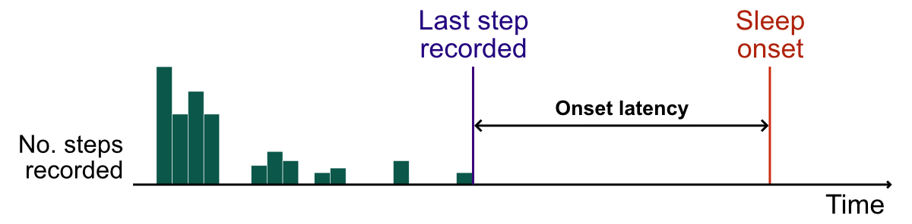

\clearpage


::: {.cell}

:::


# Measures

## Sleep features

We considered 13 sleep features, organised into three domains:

| Domain           | Feature                               | Definition                                                                                                                                                                                          |
|-------------------------|----------------------|-------------------------|
| Sleep duration   | Total sleep time†                     | Median daily hours spent asleep.                                                                                                                                                                    |
|                  | Change in total sleep time‡           | Difference in median daily hours spent asleep over the four weeks before the current outcome assessment (T2) versus the four weeks before to the previous outcome assessment three months ago (T1). |
|                  | Total sleep time, variance†           | Intra-individual variance in median daily hours spent asleep.                                                                                                                                       |
|                  | Change in total sleep time, variance‡ | Difference in intra-individual variance in median daily hours asleep from T2 to T1.                                                                                                                 |
| Sleep quality    | Sleep efficiency†                     | Median hours spent asleep as a proportion of hours spent in bed per day.                                                                                                                            |
|                  | Sleep fragmentation index†            | Median daily number of awakenings per hour of sleep.                                                                                                                                                |
|                  | Sleep onset latency†                  | Median time between last recorded step taken and Fitbit-derived sleep onset each day.                                                                                                               |
|                  | Sleep onset latency variance†         | Intra-individual variance in median sleep onset.                                                                                                                                                    |
| Sleep regularity | Sleep midpoint†                       | Median midpoint between sleep onset and sleep offset.                                                                                                                                               |
|                  | Sleep midpoint, variance†             | Intra-individual variance in median sleep midpoint.                                                                                                                                                 |
|                  | Change in sleep midpoint‡             | Difference in median sleep midpoint from T2 to T1.                                                                                                                                                  |
|                  | Change in sleep midpoint variance‡    | Difference in intra-individual variance in median sleep midpoint from T2 to T1.                                                                                                                     |
|                  | Social jet lag†                       | Absolute difference between weekday and weekend sleep midpoints.                                                                                                                                    |

† Measured over the four weeks prior to each outcome assessment.\
‡ Measured as the change between the four weeks before the current
outcome assessment (T2) and the four weeks before the previous outcome
assessment three months ago (T1)

Each feature was derived based on information collected in the 4 weeks
prior to the 3-monthly outcome assessment. For features measuring a
change in sleep (e.g., Δ total sleep time), we calculated the difference
between sleep over the past 4 weeks and sleep in the same period at the
previous outcome assessment:

{fig-align="center"}

### Derivation of daily sleep features

-   Sleep was continuously recorded by FitBit devices and summarised as
    a daily measure.

-   On most days, participants had a single 'sleep event' (i.e., a
    continuous episode of sleep). However, on around 10% of days
    participants recorded multiple sleep events. On those days, we used
    information for the primary sleep event only, identified as the
    largest continuous sleep event. Shorter sleep events (e.g., naps)
    were discarded.

Most sleep features were derived directly from the FitBit data (e.g.,
total hours of sleep), but some required further processing:

-   **Onset latency** refers to the time between going to bed and
    falling asleep (sleep onset). We derived this by combining
    information on sleep with information on physical activity.
    Specifically, we defined onset latency as the period between the
    last step recorded (via FitBit) and the onset of sleep (via FitBit).

{fig-align="center"}

### Derivation of sleep features in the four weeks before each outcome assessment

-   We derived sleep features by summarising the daily measures over the
    four weeks before each 3-monthly outcome assessment. Each feature
    represented the median or variance of the available daily values.

-   We used information for weekdays only (with the exception of "social
    jetlag") to avoid overestimating variability due to differences
    between weekdays versus weekends.

-   At each 3-monthly assessment, we included participants who provided
    sleep information on at least 8 (non-consecutive) weekdays over the
    previous four weeks. We chose a minimum of 8 weekdays to provide
    reliable summaries whilst minimising selection bias (participants
    wearing their FitBit for more than eight days tended to have lower
    depressive symptoms and more stable sleep patterns).

-   "Social jet lag" was calculated as the difference in the mean sleep
    midpoints for weekdays versus weekends.

## Covariates

We considered four covariates measured at enrolment:

-   Male gender (0/1);
-   Partnership status (0/1);
-   Years of age (continuous);
-   Years of education (continuous).

And four covariates measured repeatedly at each three-monthly outcome
assessment:

-   Atypical depression subtype;
-   Current medication use;
-   Alcohol use;
-   Hours of daylight;

### Atypical depression

Following @novick2005, we defined 'atypical depression' based on
consensus-selected items of the IDS-SR (Inventory of Depressive
Symptomatology Self-Report). To be classified as atypical, participants
needed to report (1) a score of 0-2 for 'mood reactivity'; *and* (2) at
least two of the following symptoms:

1.  Leaden paralysis (a score of 2-3);
2.  Weight gain *or* increased appetite (a score of 2-3);
3.  Hypersomnia (a score of 2-3);
4.  Interpersonal sensitivity (a score of 3).

### Current medication use

At enrolment and each 3-monthly assessment, participants were asked to
list medication they were currently taking as part of the Client Service
Receipt Inventory (CSRI).

After correcting typographical errors, we categorised each medication
based on expert opinion into three categories:

1.  **Depression-related**
    -   Antidepressants
    -   Antipsychotics
    -   Anticonvulsants
2.  **Sleep-related**
    -   Benzodiazepines
    -   Hypnotics
3.  **Other**

These were entered into the models as three binary variables (0/1)
indicating whether the participant was currently using each type of
medication.

### Alcohol use

Alcohol use was measured using the total score on the Alcohol Use
Disorders Identification Test (AUDIT).

### Hours of daylight

To account for seasonal differences in sleep and mood, we adjusted for the 
mean hours of sunshine in the four weeks before each three-monthly outcome 
assessment.

Information from the World Meteorological Organization (WMO) was extracted from
UNdata[^un] for three cities corresponding to the three RADAR-MDD sites:

WMO city                                RADAR-MDD site
--------------------------------------  --------------------
De Bilt, Utrecht, The Netherlands.      Amsterdam
London Gatwick, London, United Kingdom. King's College London
Madrid, Spain                           CIBER Madrid

WMO define hours of sunshine as the period during which direct solar irradiance
exceeds 120 watts per square meter. This value is equivalent to the level of solar irradiance shortly after sunrise or shortly before sunset in cloud-free conditions.

[^un]: <http://data.un.org/Data.aspx?d=CLINO&f=ElementCode%3a15>

# Computing

## Software

All analyses were conducted in R 4.2.2. The main packages used were:

-   [`brms`](https://CRAN.R-project.org/package=brms) 2.18;

-   [`cmdstanr`](https://mc-stan.org/cmdstanr/) 0.5.3, using
    [CmdStan](https://mc-stan.org/users/interfaces/cmdstan) 2.30.1;

-   [`tidyverse`](https://CRAN.R-project.org/package=tidyverse) 2.0.0;

-   [`marginaleffects`](https://CRAN.R-project.org/package=marginaleffects)
    0.10.0.

A full list of packages is provided in the `renv.lock` file.

## Session information


::: {.cell}

```{.r .cell-code}
sessionInfo()
```

::: {.cell-output .cell-output-stdout}
```
R version 4.2.2 Patched (2022-11-10 r83330)
Platform: x86_64-pc-linux-gnu (64-bit)
Running under: Ubuntu 22.04.2 LTS

Matrix products: default
BLAS:   /usr/lib/x86_64-linux-gnu/blas/libblas.so.3.10.0
LAPACK: /usr/lib/x86_64-linux-gnu/lapack/liblapack.so.3.10.0

locale:
 [1] LC_CTYPE=en_GB.UTF-8       LC_NUMERIC=C              
 [3] LC_TIME=en_GB.UTF-8        LC_COLLATE=en_GB.UTF-8    
 [5] LC_MONETARY=en_GB.UTF-8    LC_MESSAGES=en_GB.UTF-8   
 [7] LC_PAPER=en_GB.UTF-8       LC_NAME=C                 
 [9] LC_ADDRESS=C               LC_TELEPHONE=C            
[11] LC_MEASUREMENT=en_GB.UTF-8 LC_IDENTIFICATION=C       

attached base packages:
[1] splines   stats     graphics  grDevices utils     datasets  methods  
[8] base     

other attached packages:
 [1] knitr_1.42             ggmcmc_1.5.1.1         gt_0.8.0              
 [4] data.table_1.14.8      janitor_2.2.0          marginaleffects_0.10.0
 [7] gtsummary_1.7.0        scales_1.2.1           tidybayes_3.0.3       
[10] cmdstanr_0.5.3         brms_2.18.0            Rcpp_1.0.10           
[13] here_1.0.1             forcats_1.0.0          stringr_1.5.0         
[16] dplyr_1.1.0            purrr_1.0.1            readr_2.1.4           
[19] tidyr_1.3.0            tibble_3.1.8           ggplot2_3.4.1         
[22] tidyverse_1.3.2       

loaded via a namespace (and not attached):
  [1] readxl_1.4.2         backports_1.4.1      plyr_1.8.8          
  [4] igraph_1.4.1         svUnit_1.0.6         crosstalk_1.2.0     
  [7] rstantools_2.2.0     inline_0.3.19        digest_0.6.31       
 [10] htmltools_0.5.4      fansi_1.0.4          magrittr_2.0.3      
 [13] checkmate_2.1.0      googlesheets4_1.0.1  tzdb_0.3.0          
 [16] modelr_0.1.10        RcppParallel_5.1.7   matrixStats_0.63.0  
 [19] xts_0.13.0           timechange_0.2.0     prettyunits_1.1.1   
 [22] colorspace_2.1-0     rvest_1.0.3          ggdist_3.2.1        
 [25] haven_2.5.1          xfun_0.37            callr_3.7.3         
 [28] crayon_1.5.2         jsonlite_1.8.4       zoo_1.8-11          
 [31] glue_1.6.2           gtable_0.3.1         gargle_1.3.0        
 [34] distributional_0.3.1 pkgbuild_1.4.0       rstan_2.21.8        
 [37] abind_1.4-5          mvtnorm_1.1-3        GGally_2.1.2        
 [40] DBI_1.1.3            miniUI_0.1.1.1       xtable_1.8-4        
 [43] stats4_4.2.2         StanHeaders_2.21.0-7 DT_0.27             
 [46] htmlwidgets_1.6.1    httr_1.4.4           threejs_0.3.3       
 [49] RColorBrewer_1.1-3   arrayhelpers_1.1-0   posterior_1.4.0     
 [52] ellipsis_0.3.2       reshape_0.8.9        pkgconfig_2.0.3     
 [55] loo_2.5.1            farver_2.1.1         dbplyr_2.3.0        
 [58] utf8_1.2.3           tidyselect_1.2.0     rlang_1.0.6         
 [61] reshape2_1.4.4       later_1.3.0          munsell_0.5.0       
 [64] cellranger_1.1.0     tools_4.2.2          cli_3.6.0           
 [67] generics_0.1.3       broom_1.0.3          evaluate_0.20       
 [70] fastmap_1.1.0        yaml_2.3.7           processx_3.8.0      
 [73] fs_1.6.1             nlme_3.1-162         mime_0.12           
 [76] xml2_1.3.3           compiler_4.2.2       bayesplot_1.10.0    
 [79] shinythemes_1.2.0    rstudioapi_0.14      reprex_2.0.2        
 [82] broom.helpers_1.12.0 stringi_1.7.12       ps_1.7.2            
 [85] Brobdingnag_1.2-9    lattice_0.20-45      Matrix_1.5-1        
 [88] markdown_1.5         shinyjs_2.1.0        tensorA_0.36.2      
 [91] vctrs_0.5.2          pillar_1.8.1         lifecycle_1.0.3     
 [94] bridgesampling_1.1-2 httpuv_1.6.9         R6_2.5.1            
 [97] promises_1.2.0.1     gridExtra_2.3        codetools_0.2-19    
[100] colourpicker_1.2.0   gtools_3.9.4         assertthat_0.2.1    
[103] rprojroot_2.0.3      withr_2.5.0          shinystan_2.6.0     
[106] parallel_4.2.2       hms_1.1.2            grid_4.2.2          
[109] coda_0.19-4          rmarkdown_2.20       snakecase_0.11.0    
[112] googledrive_2.0.0    shiny_1.7.4          lubridate_1.9.2     
[115] base64enc_0.1-3      dygraphs_1.1.1.6    
```
:::
:::


## Source code

All code for this analysis can be found at
<https://github.com/ewancarr/radar-sleep>.

# Modelling

## Standardisation and transformation of sleep features

All sleep features were standardised (mean = 0; standard deviation = 1)
prior to modelling. Three features that measured variance were
additionally log-transformed to improve estimation and MCMC sampling:

-   Total sleep time variance;

-   Sleep onset latency variance; and

-   Sleep midpoint variance.

Three features were winsorised by setting extreme values to specified
limits:

-   Sleep midpoint (winsorised at midday);

-   Social jet lag (winsorised at ±5 hours)

## Prior distributions

We used weakly informative priors for the regression coefficients,
following McElreath @mcelreath2020, to constrain our estimates to
plausible values.

For example, for binary logistic regression models, we specified a prior
of a $\text{Normal}(0, 1.5)$ for the regression coefficients (i.e.,
normally distributed with a mean of 0 and standard deviation of 1.5),
reflecting our expectation that extreme values were unlikely. For a one
standard deviation difference in a given sleep feature, we do not think
it is plausible to find an odds ratio of greater than 12 (i.e., a
log-odds of 2.5) or less than 0.08 (a log-odds of -2.5).

### Priors for binary logistic regression models


::: {.cell}
::: {.cell-output .cell-output-stdout}
```
b ~ normal(0, 1.5)
Intercept ~ student_t(3, 0, 2.5)
<lower=0> sd ~ student_t(3, 0, 2.5)
```
:::
:::


### Priors for linear regression models


::: {.cell}
::: {.cell-output .cell-output-stdout}
```
b ~ normal(0, 2)
Intercept ~ student_t(3, 29, 16.3)
<lower=0> sd ~ student_t(3, 0, 16.3)
<lower=0> sigma ~ student_t(3, 0, 16.3)
```
:::
:::


# Posterior summaries


::: {.cell}

:::


## Depression relapse


::: {.cell}

:::

### Total sleep time, median 

```
 Family: bernoulli 
  Links: mu = logit 
Formula: rel_mod ~ z_tst_med + I(z_tst_med^2) + z_age + male + atyp + z_audit +
med_depress + med_other + med_sleep + z_edyrs + partner + z_sunshine + (1 | pid)
   Data: .data (Number of observations: 769) 
  Draws: 4 chains, each with iter = 40000; warmup = 20000; thin = 10;
         total post-warmup draws = 8000

Priors: 
b ~ normal(0, 1.5)
Intercept ~ student_t(3, 0, 2.5)
<lower=0> sd ~ student_t(3, 0, 2.5)

Group-Level Effects: 
~pid (Number of levels: 217) 
              Estimate Est.Error l-89% CI u-89% CI Rhat Bulk_ESS Tail_ESS
sd(Intercept)     0.44      0.37     0.05     1.14 1.00     7736     7823

Population-Level Effects: 
                Estimate Est.Error l-89% CI u-89% CI Rhat Bulk_ESS Tail_ESS
Intercept          -3.41      0.41    -4.15    -2.79 1.00     7637     7888
z_tst_med          -0.07      0.23    -0.46     0.29 1.00     8224     8014
Iz_tst_medE2       -0.07      0.16    -0.35     0.17 1.00     7739     8015
z_age              -0.22      0.19    -0.51     0.08 1.00     7944     7962
maleTRUE           -0.64      0.50    -1.49     0.10 1.00     7666     7627
atypTRUE            1.23      0.55     0.32     2.12 1.00     7841     7569
z_audit            -0.23      0.21    -0.60     0.09 1.00     8139     8164
med_depressTRUE     0.47      0.38    -0.13     1.10 1.00     8153     7715
med_otherTRUE      -0.87      1.16    -2.84     0.84 1.00     8021     7508
med_sleepTRUE       0.12      0.65    -1.00     1.10 1.00     7645     7565
z_edyrs            -0.25      0.22    -0.62     0.08 1.00     7832     7662
partnerTRUE         0.06      0.36    -0.52     0.64 1.00     8023     7761
z_sunshine         -0.18      0.20    -0.50     0.13 1.00     7899     7949

Draws were sampled using sample(hmc). For each parameter, Bulk_ESS
and Tail_ESS are effective sample size measures, and Rhat is the potential
scale reduction factor on split chains (at convergence, Rhat = 1).
```
::: {.cell-output-display}

:::

::: {.cell-output-display}

:::

::: {.cell-output-display}

:::

::: {.cell-output-display}

:::


***
### Total sleep time, variance 

```
 Family: bernoulli 
  Links: mu = logit 
Formula: rel_mod ~ zlog_tst_var + I(zlog_tst_var^2) + z_age + male + atyp + z_audit
+ med_depress + med_other + med_sleep + z_edyrs + partner + z_sunshine + (1 | pid)
   Data: .data (Number of observations: 769) 
  Draws: 4 chains, each with iter = 40000; warmup = 20000; thin = 10;
         total post-warmup draws = 8000

Priors: 
b ~ normal(0, 1.5)
Intercept ~ student_t(3, 0, 2.5)
<lower=0> sd ~ student_t(3, 0, 2.5)

Group-Level Effects: 
~pid (Number of levels: 217) 
              Estimate Est.Error l-89% CI u-89% CI Rhat Bulk_ESS Tail_ESS
sd(Intercept)     0.41      0.35     0.04     1.10 1.00     7501     6936

Population-Level Effects: 
                Estimate Est.Error l-89% CI u-89% CI Rhat Bulk_ESS Tail_ESS
Intercept          -3.51      0.43    -4.26    -2.87 1.00     8034     7491
zlog_tst_var        0.45      0.20     0.12     0.76 1.00     7866     7928
Izlog_tst_varE2     0.16      0.13    -0.07     0.35 1.00     8312     7871
z_age              -0.20      0.18    -0.48     0.09 1.00     7981     7810
maleTRUE           -0.76      0.49    -1.61     0.00 1.00     8097     7514
atypTRUE            1.13      0.56     0.18     1.99 1.00     7778     7849
z_audit            -0.27      0.22    -0.65     0.07 1.00     7926     7551
med_depressTRUE     0.37      0.38    -0.22     1.01 1.00     8002     7657
med_otherTRUE      -0.82      1.16    -2.81     0.91 1.00     7973     7418
med_sleepTRUE       0.05      0.67    -1.08     1.04 1.00     7664     8093
z_edyrs            -0.21      0.22    -0.59     0.11 1.00     7875     7776
partnerTRUE         0.14      0.36    -0.45     0.72 1.00     7776     7678
z_sunshine         -0.18      0.20    -0.50     0.14 1.00     8050     7857

Draws were sampled using sample(hmc). For each parameter, Bulk_ESS
and Tail_ESS are effective sample size measures, and Rhat is the potential
scale reduction factor on split chains (at convergence, Rhat = 1).
```
::: {.cell-output-display}

:::

::: {.cell-output-display}

:::

::: {.cell-output-display}

:::

::: {.cell-output-display}

:::


***
### Δ Total sleep time, median 

```
 Family: bernoulli 
  Links: mu = logit 
Formula: rel_mod ~ z_cm3_tst_med + I(z_cm3_tst_med^2) + z_age + male + atyp +
z_audit + med_depress + med_other + med_sleep + z_edyrs + partner + z_sunshine + (1
| pid)
   Data: .data (Number of observations: 608) 
  Draws: 4 chains, each with iter = 40000; warmup = 20000; thin = 10;
         total post-warmup draws = 8000

Priors: 
b ~ normal(0, 1.5)
Intercept ~ student_t(3, 0, 2.5)
<lower=0> sd ~ student_t(3, 0, 2.5)

Group-Level Effects: 
~pid (Number of levels: 213) 
              Estimate Est.Error l-89% CI u-89% CI Rhat Bulk_ESS Tail_ESS
sd(Intercept)     0.52      0.41     0.06     1.29 1.00     6866     7424

Population-Level Effects: 
                 Estimate Est.Error l-89% CI u-89% CI Rhat Bulk_ESS Tail_ESS
Intercept           -3.32      0.45    -4.13    -2.66 1.00     7403     7583
z_cm3_tst_med        0.08      0.18    -0.21     0.39 1.00     7719     7673
Iz_cm3_tst_medE2     0.12      0.08    -0.02     0.25 1.00     8246     7761
z_age               -0.25      0.19    -0.55     0.05 1.00     8064     7663
maleTRUE            -0.62      0.50    -1.47     0.14 1.00     8103     8011
atypTRUE             1.33      0.58     0.36     2.24 1.00     7056     7519
z_audit             -0.26      0.22    -0.63     0.07 1.00     7429     7532
med_depressTRUE      0.37      0.39    -0.24     1.01 1.00     7714     7266
med_otherTRUE       -0.86      1.16    -2.82     0.84 1.00     7848     7635
med_sleepTRUE       -0.09      0.67    -1.20     0.93 1.00     7861     7774
z_edyrs             -0.18      0.22    -0.57     0.15 1.00     8068     7691
partnerTRUE          0.17      0.37    -0.42     0.78 1.00     7637     7848
z_sunshine          -0.10      0.20    -0.42     0.21 1.00     8046     7778

Draws were sampled using sample(hmc). For each parameter, Bulk_ESS
and Tail_ESS are effective sample size measures, and Rhat is the potential
scale reduction factor on split chains (at convergence, Rhat = 1).
```
::: {.cell-output-display}

:::

::: {.cell-output-display}

:::

::: {.cell-output-display}

:::

::: {.cell-output-display}

:::


***
### Δ Total sleep time, variance 

```
 Family: bernoulli 
  Links: mu = logit 
Formula: rel_mod ~ z_cm3_tst_var + I(z_cm3_tst_var^2) + z_age + male + atyp +
z_audit + med_depress + med_other + med_sleep + z_edyrs + partner + z_sunshine + (1
| pid)
   Data: .data (Number of observations: 608) 
  Draws: 4 chains, each with iter = 40000; warmup = 20000; thin = 10;
         total post-warmup draws = 8000

Priors: 
b ~ normal(0, 1.5)
Intercept ~ student_t(3, 0, 2.5)
<lower=0> sd ~ student_t(3, 0, 2.5)

Group-Level Effects: 
~pid (Number of levels: 213) 
              Estimate Est.Error l-89% CI u-89% CI Rhat Bulk_ESS Tail_ESS
sd(Intercept)     0.55      0.44     0.06     1.39 1.00     6726     6456

Population-Level Effects: 
                 Estimate Est.Error l-89% CI u-89% CI Rhat Bulk_ESS Tail_ESS
Intercept           -3.48      0.47    -4.33    -2.79 1.00     7599     7244
z_cm3_tst_var        0.53      0.21     0.21     0.89 1.00     8146     7927
Iz_cm3_tst_varE2     0.10      0.07    -0.02     0.22 1.00     7650     7148
z_age               -0.31      0.19    -0.61    -0.01 1.00     7871     7685
maleTRUE            -0.76      0.54    -1.66     0.05 1.00     7849     7484
atypTRUE             1.37      0.60     0.38     2.31 1.00     7930     7851
z_audit             -0.25      0.23    -0.64     0.09 1.00     8005     7505
med_depressTRUE      0.42      0.39    -0.20     1.06 1.00     7574     7728
med_otherTRUE       -0.81      1.20    -2.87     0.95 1.00     7785     7655
med_sleepTRUE        0.02      0.66    -1.13     1.07 1.00     7578     7533
z_edyrs             -0.20      0.23    -0.60     0.13 1.00     7855     7797
partnerTRUE          0.30      0.38    -0.32     0.92 1.00     8014     7871
z_sunshine          -0.18      0.21    -0.51     0.15 1.00     7799     7973

Draws were sampled using sample(hmc). For each parameter, Bulk_ESS
and Tail_ESS are effective sample size measures, and Rhat is the potential
scale reduction factor on split chains (at convergence, Rhat = 1).
```
::: {.cell-output-display}

:::

::: {.cell-output-display}

:::

::: {.cell-output-display}

:::

::: {.cell-output-display}

:::


***
### Sleep efficiency, median 

```
 Family: bernoulli 
  Links: mu = logit 
Formula: rel_mod ~ z_slpeff_med + I(z_slpeff_med^2) + z_age + male + atyp + z_audit
+ med_depress + med_other + med_sleep + z_edyrs + partner + z_sunshine + (1 | pid)
   Data: .data (Number of observations: 769) 
  Draws: 4 chains, each with iter = 40000; warmup = 20000; thin = 10;
         total post-warmup draws = 8000

Priors: 
b ~ normal(0, 1.5)
Intercept ~ student_t(3, 0, 2.5)
<lower=0> sd ~ student_t(3, 0, 2.5)

Group-Level Effects: 
~pid (Number of levels: 217) 
              Estimate Est.Error l-89% CI u-89% CI Rhat Bulk_ESS Tail_ESS
sd(Intercept)     0.46      0.38     0.05     1.18 1.00     7240     7464

Population-Level Effects: 
                Estimate Est.Error l-89% CI u-89% CI Rhat Bulk_ESS Tail_ESS
Intercept          -3.42      0.44    -4.22    -2.76 1.00     7761     7758
z_slpeff_med       -0.15      0.21    -0.49     0.17 1.00     7791     7652
Iz_slpeff_medE2    -0.04      0.11    -0.23     0.13 1.00     8280     7569
z_age              -0.22      0.18    -0.51     0.07 1.00     8064     7377
maleTRUE           -0.65      0.49    -1.48     0.09 1.00     7938     7176
atypTRUE            1.20      0.56     0.26     2.07 1.00     8198     7470
z_audit            -0.24      0.22    -0.60     0.08 1.00     7837     7358
med_depressTRUE     0.48      0.38    -0.11     1.10 1.00     7173     7562
med_otherTRUE      -0.85      1.17    -2.89     0.81 1.00     7563     7464
med_sleepTRUE       0.10      0.66    -1.04     1.06 1.00     8046     7379
z_edyrs            -0.23      0.22    -0.62     0.09 1.00     7835     7824
partnerTRUE         0.04      0.37    -0.55     0.63 1.00     8043     7817
z_sunshine         -0.15      0.20    -0.48     0.16 1.00     7685     7659

Draws were sampled using sample(hmc). For each parameter, Bulk_ESS
and Tail_ESS are effective sample size measures, and Rhat is the potential
scale reduction factor on split chains (at convergence, Rhat = 1).
```
::: {.cell-output-display}

:::

::: {.cell-output-display}

:::

::: {.cell-output-display}

:::

::: {.cell-output-display}

:::


***
### Sleep fragmentation index, median 

```
 Family: bernoulli 
  Links: mu = logit 
Formula: rel_mod ~ z_sfi_med + I(z_sfi_med^2) + z_age + male + atyp + z_audit +
med_depress + med_other + med_sleep + z_edyrs + partner + z_sunshine + (1 | pid)
   Data: .data (Number of observations: 769) 
  Draws: 4 chains, each with iter = 40000; warmup = 20000; thin = 10;
         total post-warmup draws = 8000

Priors: 
b ~ normal(0, 1.5)
Intercept ~ student_t(3, 0, 2.5)
<lower=0> sd ~ student_t(3, 0, 2.5)

Group-Level Effects: 
~pid (Number of levels: 217) 
              Estimate Est.Error l-89% CI u-89% CI Rhat Bulk_ESS Tail_ESS
sd(Intercept)     0.46      0.37     0.05     1.16 1.00     7775     7361

Population-Level Effects: 
                Estimate Est.Error l-89% CI u-89% CI Rhat Bulk_ESS Tail_ESS
Intercept          -3.56      0.46    -4.36    -2.89 1.00     7788     7500
z_sfi_med           0.25      0.21    -0.07     0.59 1.00     8010     8151
Iz_sfi_medE2        0.03      0.12    -0.18     0.20 1.00     7979     7848
z_age              -0.27      0.18    -0.57     0.03 1.00     7976     7932
maleTRUE           -0.63      0.50    -1.47     0.11 1.00     7885     7597
atypTRUE            1.24      0.57     0.28     2.12 1.00     7814     7846
z_audit            -0.25      0.21    -0.62     0.07 1.00     8064     8089
med_depressTRUE     0.56      0.39    -0.04     1.19 1.00     7863     7849
med_otherTRUE      -0.84      1.14    -2.83     0.88 1.00     7729     7387
med_sleepTRUE       0.09      0.64    -1.03     1.09 1.00     8380     7996
z_edyrs            -0.22      0.22    -0.60     0.10 1.00     7836     7767
partnerTRUE         0.06      0.36    -0.50     0.66 1.00     8169     7890
z_sunshine         -0.17      0.20    -0.49     0.14 1.00     8053     7908

Draws were sampled using sample(hmc). For each parameter, Bulk_ESS
and Tail_ESS are effective sample size measures, and Rhat is the potential
scale reduction factor on split chains (at convergence, Rhat = 1).
```
::: {.cell-output-display}

:::

::: {.cell-output-display}

:::

::: {.cell-output-display}

:::

::: {.cell-output-display}

:::


***
### Sleep onset latency, median 

```
 Family: bernoulli 
  Links: mu = logit 
Formula: rel_mod ~ z_sol_med + I(z_sol_med^2) + z_age + male + atyp + z_audit +
med_depress + med_other + med_sleep + z_edyrs + partner + z_sunshine + (1 | pid)
   Data: .data (Number of observations: 768) 
  Draws: 4 chains, each with iter = 40000; warmup = 20000; thin = 10;
         total post-warmup draws = 8000

Priors: 
b ~ normal(0, 1.5)
Intercept ~ student_t(3, 0, 2.5)
<lower=0> sd ~ student_t(3, 0, 2.5)

Group-Level Effects: 
~pid (Number of levels: 217) 
              Estimate Est.Error l-89% CI u-89% CI Rhat Bulk_ESS Tail_ESS
sd(Intercept)     0.44      0.37     0.04     1.13 1.00     7653     7932

Population-Level Effects: 
                Estimate Est.Error l-89% CI u-89% CI Rhat Bulk_ESS Tail_ESS
Intercept          -3.39      0.42    -4.12    -2.75 1.00     7789     7412
z_sol_med          -0.08      0.31    -0.60     0.40 1.00     7872     7728
Iz_sol_medE2       -0.05      0.12    -0.31     0.09 1.00     8153     7804
z_age              -0.19      0.18    -0.47     0.10 1.00     8090     7794
maleTRUE           -0.63      0.49    -1.48     0.11 1.00     7612     7929
atypTRUE            1.23      0.57     0.29     2.10 1.00     7856     7603
z_audit            -0.24      0.22    -0.60     0.08 1.00     8031     7729
med_depressTRUE     0.41      0.38    -0.16     1.05 1.00     7938     7847
med_otherTRUE      -0.90      1.14    -2.86     0.83 1.00     7895     7886
med_sleepTRUE       0.07      0.66    -1.05     1.03 1.00     8197     7848
z_edyrs            -0.24      0.22    -0.63     0.09 1.00     8068     7827
partnerTRUE         0.04      0.35    -0.53     0.62 1.00     7037     7848
z_sunshine         -0.17      0.19    -0.48     0.14 1.00     7927     7702

Draws were sampled using sample(hmc). For each parameter, Bulk_ESS
and Tail_ESS are effective sample size measures, and Rhat is the potential
scale reduction factor on split chains (at convergence, Rhat = 1).
```
::: {.cell-output-display}

:::

::: {.cell-output-display}

:::

::: {.cell-output-display}

:::

::: {.cell-output-display}

:::


***
### Sleep onset latency, variance 

```
 Family: bernoulli 
  Links: mu = logit 
Formula: rel_mod ~ zlog_sol_var + I(zlog_sol_var^2) + z_age + male + atyp + z_audit
+ med_depress + med_other + med_sleep + z_edyrs + partner + z_sunshine + (1 | pid)
   Data: .data (Number of observations: 764) 
  Draws: 4 chains, each with iter = 40000; warmup = 20000; thin = 10;
         total post-warmup draws = 8000

Priors: 
b ~ normal(0, 1.5)
Intercept ~ student_t(3, 0, 2.5)
<lower=0> sd ~ student_t(3, 0, 2.5)

Group-Level Effects: 
~pid (Number of levels: 217) 
              Estimate Est.Error l-89% CI u-89% CI Rhat Bulk_ESS Tail_ESS
sd(Intercept)     0.45      0.38     0.04     1.16 1.00     7126     7497

Population-Level Effects: 
                Estimate Est.Error l-89% CI u-89% CI Rhat Bulk_ESS Tail_ESS
Intercept          -3.45      0.44    -4.27    -2.78 1.00     7813     7884
zlog_sol_var       -0.06      0.19    -0.38     0.24 1.00     8098     7848
Izlog_sol_varE2    -0.06      0.14    -0.31     0.13 1.00     8035     7414
z_age              -0.20      0.18    -0.49     0.08 1.00     8341     8012
maleTRUE           -0.58      0.49    -1.43     0.16 1.00     7889     7192
atypTRUE            1.25      0.55     0.31     2.12 1.00     7913     7692
z_audit            -0.23      0.21    -0.60     0.10 1.00     8145     7754
med_depressTRUE     0.54      0.39    -0.07     1.18 1.00     8002     7756
med_otherTRUE      -0.80      1.17    -2.82     0.89 1.00     7703     7586
med_sleepTRUE       0.06      0.65    -1.03     1.05 1.00     7692     8152
z_edyrs            -0.22      0.22    -0.59     0.10 1.00     7722     8083
partnerTRUE         0.01      0.36    -0.60     0.59 1.00     7777     7832
z_sunshine         -0.12      0.20    -0.45     0.19 1.00     7624     8076

Draws were sampled using sample(hmc). For each parameter, Bulk_ESS
and Tail_ESS are effective sample size measures, and Rhat is the potential
scale reduction factor on split chains (at convergence, Rhat = 1).
```
::: {.cell-output-display}

:::

::: {.cell-output-display}

:::

::: {.cell-output-display}

:::

::: {.cell-output-display}

:::


***
### Sleep midpoint, median 

```
 Family: bernoulli 
  Links: mu = logit 
Formula: rel_mod ~ z_smid_med + I(z_smid_med^2) + z_age + male + atyp + z_audit +
med_depress + med_other + med_sleep + z_edyrs + partner + z_sunshine + (1 | pid)
   Data: .data (Number of observations: 769) 
  Draws: 4 chains, each with iter = 40000; warmup = 20000; thin = 10;
         total post-warmup draws = 8000

Priors: 
b ~ normal(0, 1.5)
Intercept ~ student_t(3, 0, 2.5)
<lower=0> sd ~ student_t(3, 0, 2.5)

Group-Level Effects: 
~pid (Number of levels: 217) 
              Estimate Est.Error l-89% CI u-89% CI Rhat Bulk_ESS Tail_ESS
sd(Intercept)     0.45      0.37     0.05     1.14 1.00     7146     7688

Population-Level Effects: 
                Estimate Est.Error l-89% CI u-89% CI Rhat Bulk_ESS Tail_ESS
Intercept          -3.27      0.45    -4.04    -2.61 1.00     7913     7826
z_smid_med          0.26      0.25    -0.14     0.67 1.00     8102     7933
Iz_smid_medE2      -0.14      0.15    -0.43     0.05 1.00     8221     7971
z_age              -0.16      0.18    -0.45     0.13 1.00     8025     8012
maleTRUE           -0.64      0.50    -1.48     0.10 1.00     7440     7281
atypTRUE            1.14      0.57     0.17     2.00 1.00     7868     7864
z_audit            -0.25      0.22    -0.63     0.08 1.00     7665     7731
med_depressTRUE     0.40      0.39    -0.20     1.01 1.00     7851     7767
med_otherTRUE      -0.86      1.17    -2.91     0.83 1.00     7818     7752
med_sleepTRUE       0.08      0.66    -1.02     1.08 1.00     8260     7644
z_edyrs            -0.21      0.21    -0.58     0.10 1.00     8251     7667
partnerTRUE         0.06      0.37    -0.53     0.66 1.00     7998     7754
z_sunshine         -0.18      0.20    -0.50     0.13 1.00     7811     7466

Draws were sampled using sample(hmc). For each parameter, Bulk_ESS
and Tail_ESS are effective sample size measures, and Rhat is the potential
scale reduction factor on split chains (at convergence, Rhat = 1).
```
::: {.cell-output-display}

:::

::: {.cell-output-display}

:::

::: {.cell-output-display}

:::

::: {.cell-output-display}

:::


***
### Sleep midpoint, variance 

```
 Family: bernoulli 
  Links: mu = logit 
Formula: rel_mod ~ zlog_smid_var + I(zlog_smid_var^2) + z_age + male + atyp +
z_audit + med_depress + med_other + med_sleep + z_edyrs + partner + z_sunshine + (1
| pid)
   Data: .data (Number of observations: 769) 
  Draws: 4 chains, each with iter = 40000; warmup = 20000; thin = 10;
         total post-warmup draws = 8000

Priors: 
b ~ normal(0, 1.5)
Intercept ~ student_t(3, 0, 2.5)
<lower=0> sd ~ student_t(3, 0, 2.5)

Group-Level Effects: 
~pid (Number of levels: 217) 
              Estimate Est.Error l-89% CI u-89% CI Rhat Bulk_ESS Tail_ESS
sd(Intercept)     0.43      0.35     0.04     1.08 1.00     7437     7633

Population-Level Effects: 
                 Estimate Est.Error l-89% CI u-89% CI Rhat Bulk_ESS Tail_ESS
Intercept           -3.35      0.45    -4.11    -2.71 1.00     7740     7776
zlog_smid_var        0.12      0.20    -0.22     0.44 1.00     8441     7492
Izlog_smid_varE2    -0.05      0.16    -0.33     0.18 1.00     7947     7848
z_age               -0.18      0.18    -0.46     0.10 1.00     7859     7748
maleTRUE            -0.65      0.49    -1.50     0.08 1.00     7783     7877
atypTRUE             1.20      0.55     0.27     2.07 1.00     7906     7806
z_audit             -0.24      0.21    -0.61     0.08 1.00     7535     7271
med_depressTRUE      0.42      0.38    -0.17     1.05 1.00     7405     7970
med_otherTRUE       -0.88      1.17    -2.88     0.83 1.00     7114     7342
med_sleepTRUE        0.08      0.64    -1.06     1.05 1.00     7981     7263
z_edyrs             -0.22      0.21    -0.60     0.08 1.00     8076     7843
partnerTRUE          0.08      0.36    -0.52     0.66 1.00     8030     7797
z_sunshine          -0.17      0.19    -0.49     0.14 1.00     7932     7847

Draws were sampled using sample(hmc). For each parameter, Bulk_ESS
and Tail_ESS are effective sample size measures, and Rhat is the potential
scale reduction factor on split chains (at convergence, Rhat = 1).
```
::: {.cell-output-display}

:::

::: {.cell-output-display}

:::

::: {.cell-output-display}

:::

::: {.cell-output-display}

:::


***
### Δ Sleep midpoint, median 

```
 Family: bernoulli 
  Links: mu = logit 
Formula: rel_mod ~ z_cm3_smid_med + I(z_cm3_smid_med^2) + z_age + male + atyp +
z_audit + med_depress + med_other + med_sleep + z_edyrs + partner + z_sunshine + (1
| pid)
   Data: .data (Number of observations: 608) 
  Draws: 4 chains, each with iter = 40000; warmup = 20000; thin = 10;
         total post-warmup draws = 8000

Priors: 
b ~ normal(0, 1.5)
Intercept ~ student_t(3, 0, 2.5)
<lower=0> sd ~ student_t(3, 0, 2.5)

Group-Level Effects: 
~pid (Number of levels: 213) 
              Estimate Est.Error l-89% CI u-89% CI Rhat Bulk_ESS Tail_ESS
sd(Intercept)     0.51      0.42     0.06     1.28 1.00     5938     5228

Population-Level Effects: 
                  Estimate Est.Error l-89% CI u-89% CI Rhat Bulk_ESS Tail_ESS
Intercept            -3.06      0.44    -3.86    -2.41 1.00     7403     6414
z_cm3_smid_med        0.26      0.31    -0.25     0.79 1.00     7798     7832
Iz_cm3_smid_medE2    -0.51      0.30    -1.07    -0.12 1.00     8096     7729
z_age                -0.28      0.18    -0.59     0.01 1.00     7010     7882
maleTRUE             -0.47      0.50    -1.31     0.29 1.00     7701     8000
atypTRUE              1.31      0.59     0.34     2.23 1.00     8131     7752
z_audit              -0.25      0.22    -0.63     0.07 1.00     7455     7282
med_depressTRUE       0.50      0.39    -0.10     1.15 1.00     8293     8012
med_otherTRUE        -0.80      1.16    -2.90     0.91 1.00     7773     7744
med_sleepTRUE        -0.00      0.66    -1.12     0.99 1.00     7829     7781
z_edyrs              -0.24      0.23    -0.63     0.09 1.00     7853     7670
partnerTRUE           0.05      0.37    -0.53     0.67 1.00     7920     8009
z_sunshine           -0.08      0.20    -0.41     0.23 1.00     8045     7860

Draws were sampled using sample(hmc). For each parameter, Bulk_ESS
and Tail_ESS are effective sample size measures, and Rhat is the potential
scale reduction factor on split chains (at convergence, Rhat = 1).
```
::: {.cell-output-display}

:::

::: {.cell-output-display}

:::

::: {.cell-output-display}

:::

::: {.cell-output-display}

:::


***
### Δ Sleep midpoint, variance 

```
 Family: bernoulli 
  Links: mu = logit 
Formula: rel_mod ~ z_cm3_smid_var + I(z_cm3_smid_var^2) + z_age + male + atyp +
z_audit + med_depress + med_other + med_sleep + z_edyrs + partner + z_sunshine + (1
| pid)
   Data: .data (Number of observations: 608) 
  Draws: 4 chains, each with iter = 40000; warmup = 20000; thin = 10;
         total post-warmup draws = 8000

Priors: 
b ~ normal(0, 1.5)
Intercept ~ student_t(3, 0, 2.5)
<lower=0> sd ~ student_t(3, 0, 2.5)

Group-Level Effects: 
~pid (Number of levels: 213) 
              Estimate Est.Error l-89% CI u-89% CI Rhat Bulk_ESS Tail_ESS
sd(Intercept)     0.52      0.41     0.06     1.29 1.00     7417     7351

Population-Level Effects: 
                  Estimate Est.Error l-89% CI u-89% CI Rhat Bulk_ESS Tail_ESS
Intercept            -3.32      0.46    -4.14    -2.66 1.00     8050     7835
z_cm3_smid_var        0.17      0.20    -0.15     0.52 1.00     7951     7931
Iz_cm3_smid_varE2     0.05      0.06    -0.07     0.14 1.00     7909     7613
z_age                -0.27      0.18    -0.57     0.02 1.00     8144     7849
maleTRUE             -0.59      0.51    -1.43     0.18 1.00     8139     8013
atypTRUE              1.31      0.59     0.36     2.24 1.00     7712     7540
z_audit              -0.25      0.22    -0.62     0.08 1.00     8067     7807
med_depressTRUE       0.46      0.39    -0.15     1.11 1.00     8026     7917
med_otherTRUE        -0.85      1.18    -2.85     0.84 1.00     7792     7834
med_sleepTRUE        -0.02      0.66    -1.12     1.01 1.00     7899     7601
z_edyrs              -0.19      0.22    -0.57     0.13 1.00     8146     7599
partnerTRUE           0.17      0.38    -0.42     0.76 1.00     8279     6929
z_sunshine           -0.11      0.20    -0.44     0.21 1.00     7749     7786

Draws were sampled using sample(hmc). For each parameter, Bulk_ESS
and Tail_ESS are effective sample size measures, and Rhat is the potential
scale reduction factor on split chains (at convergence, Rhat = 1).
```
::: {.cell-output-display}

:::

::: {.cell-output-display}

:::

::: {.cell-output-display}

:::

::: {.cell-output-display}

:::


***
### Social jet lag 

```
 Family: bernoulli 
  Links: mu = logit 
Formula: rel_mod ~ z_sjl + I(z_sjl^2) + z_age + male + atyp + z_audit + med_depress
+ med_other + med_sleep + z_edyrs + partner + z_sunshine + (1 | pid)
   Data: .data (Number of observations: 769) 
  Draws: 4 chains, each with iter = 40000; warmup = 20000; thin = 10;
         total post-warmup draws = 8000

Priors: 
b ~ normal(0, 1.5)
Intercept ~ student_t(3, 0, 2.5)
<lower=0> sd ~ student_t(3, 0, 2.5)

Group-Level Effects: 
~pid (Number of levels: 217) 
              Estimate Est.Error l-89% CI u-89% CI Rhat Bulk_ESS Tail_ESS
sd(Intercept)     0.43      0.36     0.04     1.09 1.00     7162     7441

Population-Level Effects: 
                Estimate Est.Error l-89% CI u-89% CI Rhat Bulk_ESS Tail_ESS
Intercept          -3.31      0.42    -4.04    -2.70 1.00     8101     7846
z_sjl              -0.17      0.27    -0.63     0.25 1.00     8134     7957
Iz_sjlE2           -0.25      0.19    -0.64    -0.01 1.00     8110     8226
z_age              -0.20      0.18    -0.50     0.07 1.00     7726     7521
maleTRUE           -0.58      0.48    -1.39     0.16 1.00     7851     7639
atypTRUE            1.18      0.55     0.23     2.04 1.00     8032     7979
z_audit            -0.22      0.22    -0.59     0.10 1.00     7961     7514
med_depressTRUE     0.45      0.38    -0.15     1.07 1.00     7905     7810
med_otherTRUE      -0.90      1.14    -2.91     0.76 1.00     8184     7592
med_sleepTRUE       0.14      0.64    -0.97     1.13 1.00     7921     7738
z_edyrs            -0.25      0.22    -0.61     0.08 1.00     8189     8013
partnerTRUE         0.03      0.36    -0.53     0.62 1.00     8060     7851
z_sunshine         -0.18      0.20    -0.49     0.13 1.00     7754     7884

Draws were sampled using sample(hmc). For each parameter, Bulk_ESS
and Tail_ESS are effective sample size measures, and Rhat is the potential
scale reduction factor on split chains (at convergence, Rhat = 1).
```
::: {.cell-output-display}

:::

::: {.cell-output-display}

:::

::: {.cell-output-display}

:::

::: {.cell-output-display}

:::


***


## Depression severity


### Total sleep time, median 

```
 Family: gaussian 
  Links: mu = identity; sigma = identity 
Formula: ids_total ~ lag_ids_total + I(lag_ids_total^2) + z_tst_med + I(z_tst_med^2)
+ z_age + male + atyp + z_audit + med_depress + med_other + med_sleep + z_edyrs +
partner + z_sunshine + (1 | pid)
   Data: .data (Number of observations: 1373) 
  Draws: 4 chains, each with iter = 40000; warmup = 20000; thin = 10;
         total post-warmup draws = 8000

Priors: 
b ~ normal(0, 2)
Intercept ~ student_t(3, 29, 16.3)
<lower=0> sd ~ student_t(3, 0, 16.3)
<lower=0> sigma ~ student_t(3, 0, 16.3)

Group-Level Effects: 
~pid (Number of levels: 390) 
              Estimate Est.Error l-89% CI u-89% CI Rhat Bulk_ESS Tail_ESS
sd(Intercept)     0.52      0.45     0.06     1.44 1.00     7692     8058

Population-Level Effects: 
                 Estimate Est.Error l-89% CI u-89% CI Rhat Bulk_ESS Tail_ESS
Intercept            9.04      1.00     7.38    10.72 1.00     8189     7738
lag_ids_total        0.53      0.06     0.44     0.63 1.00     7984     7048
Ilag_ids_totalE2     0.00      0.00     0.00     0.00 1.00     7948     7918
z_tst_med            0.19      0.25    -0.20     0.58 1.00     8038     7651
Iz_tst_medE2         0.27      0.14     0.03     0.50 1.00     7663     7809
z_age                0.13      0.24    -0.26     0.51 1.00     7867     7210
maleTRUE            -0.32      0.55    -1.19     0.51 1.00     7816     7845
atypTRUE             5.76      0.56     4.87     6.66 1.00     7649     7416
z_audit              0.19      0.23    -0.19     0.57 1.00     8164     8058
med_depressTRUE      0.38      0.49    -0.39     1.15 1.00     8269     8055
med_otherTRUE        1.05      1.22    -0.90     3.03 1.00     7916     7932
med_sleepTRUE        1.76      0.67     0.68     2.81 1.00     8162     7833
z_edyrs             -0.58      0.24    -0.96    -0.21 1.00     8055     7465
partnerTRUE         -0.93      0.46    -1.68    -0.19 1.00     7606     7808
z_sunshine           0.10      0.24    -0.27     0.48 1.00     8121     7602

Family Specific Parameters: 
      Estimate Est.Error l-89% CI u-89% CI Rhat Bulk_ESS Tail_ESS
sigma     8.16      0.16     7.91     8.43 1.00     7689     7890

Draws were sampled using sample(hmc). For each parameter, Bulk_ESS
and Tail_ESS are effective sample size measures, and Rhat is the potential
scale reduction factor on split chains (at convergence, Rhat = 1).
```
::: {.cell-output-display}

:::

::: {.cell-output-display}

:::

::: {.cell-output-display}

:::

::: {.cell-output-display}

:::


***
### Total sleep time, variance 

```
 Family: gaussian 
  Links: mu = identity; sigma = identity 
Formula: ids_total ~ lag_ids_total + I(lag_ids_total^2) + zlog_tst_var +
I(zlog_tst_var^2) + z_age + male + atyp + z_audit + med_depress + med_other +
med_sleep + z_edyrs + partner + z_sunshine + (1 | pid)
   Data: .data (Number of observations: 1373) 
  Draws: 4 chains, each with iter = 40000; warmup = 20000; thin = 10;
         total post-warmup draws = 8000

Priors: 
b ~ normal(0, 2)
Intercept ~ student_t(3, 29, 16.3)
<lower=0> sd ~ student_t(3, 0, 16.3)
<lower=0> sigma ~ student_t(3, 0, 16.3)

Group-Level Effects: 
~pid (Number of levels: 390) 
              Estimate Est.Error l-89% CI u-89% CI Rhat Bulk_ESS Tail_ESS
sd(Intercept)     0.57      0.50     0.06     1.56 1.00     7279     7431

Population-Level Effects: 
                 Estimate Est.Error l-89% CI u-89% CI Rhat Bulk_ESS Tail_ESS
Intercept            9.29      1.05     7.60    11.07 1.00     7561     7692
lag_ids_total        0.53      0.06     0.43     0.63 1.00     7573     7617
Ilag_ids_totalE2     0.00      0.00     0.00     0.00 1.00     7601     7917
zlog_tst_var         0.88      0.24     0.51     1.26 1.00     8226     8186
Izlog_tst_varE2      0.22      0.17    -0.04     0.48 1.00     7812     7965
z_age                0.14      0.23    -0.24     0.51 1.00     8029     7891
maleTRUE            -0.55      0.54    -1.43     0.31 1.00     8245     7823
atypTRUE             5.60      0.56     4.67     6.48 1.00     7980     7762
z_audit              0.19      0.24    -0.18     0.58 1.00     7478     8000
med_depressTRUE      0.33      0.49    -0.43     1.10 1.00     8146     8000
med_otherTRUE        1.16      1.19    -0.81     3.07 1.00     7822     7951
med_sleepTRUE        1.84      0.65     0.77     2.90 1.00     7670     7758
z_edyrs             -0.53      0.23    -0.92    -0.17 1.00     7739     7808
partnerTRUE         -0.71      0.46    -1.45     0.02 1.00     8095     7795
z_sunshine           0.04      0.23    -0.33     0.43 1.00     8359     7769

Family Specific Parameters: 
      Estimate Est.Error l-89% CI u-89% CI Rhat Bulk_ESS Tail_ESS
sigma     8.13      0.16     7.87     8.39 1.00     8082     6966

Draws were sampled using sample(hmc). For each parameter, Bulk_ESS
and Tail_ESS are effective sample size measures, and Rhat is the potential
scale reduction factor on split chains (at convergence, Rhat = 1).
```
::: {.cell-output-display}

:::

::: {.cell-output-display}

:::

::: {.cell-output-display}

:::

::: {.cell-output-display}

:::


***
### Δ Total sleep time, median 

```
 Family: gaussian 
  Links: mu = identity; sigma = identity 
Formula: ids_total ~ lag_ids_total + I(lag_ids_total^2) + z_cm3_tst_med +
I(z_cm3_tst_med^2) + z_age + male + atyp + z_audit + med_depress + med_other +
med_sleep + z_edyrs + partner + z_sunshine + (1 | pid)
   Data: .data (Number of observations: 1373) 
  Draws: 4 chains, each with iter = 40000; warmup = 20000; thin = 10;
         total post-warmup draws = 8000

Priors: 
b ~ normal(0, 2)
Intercept ~ student_t(3, 29, 16.3)
<lower=0> sd ~ student_t(3, 0, 16.3)
<lower=0> sigma ~ student_t(3, 0, 16.3)

Group-Level Effects: 
~pid (Number of levels: 390) 
              Estimate Est.Error l-89% CI u-89% CI Rhat Bulk_ESS Tail_ESS
sd(Intercept)     0.49      0.43     0.05     1.36 1.00     7589     7651

Population-Level Effects: 
                 Estimate Est.Error l-89% CI u-89% CI Rhat Bulk_ESS Tail_ESS
Intercept            8.92      1.00     7.30    10.56 1.00     7661     7888
lag_ids_total        0.55      0.06     0.45     0.64 1.00     7772     7848
Ilag_ids_totalE2     0.00      0.00     0.00     0.00 1.00     7897     8093
z_cm3_tst_med        0.27      0.22    -0.10     0.63 1.00     8014     7739
Iz_cm3_tst_medE2     0.17      0.11    -0.01     0.35 1.00     8022     7930
z_age                0.11      0.23    -0.26     0.47 1.00     7159     7913
maleTRUE            -0.38      0.53    -1.23     0.47 1.00     7639     7983
atypTRUE             5.78      0.57     4.89     6.70 1.00     7913     7681
z_audit              0.19      0.24    -0.19     0.56 1.00     7536     7206
med_depressTRUE      0.44      0.48    -0.31     1.22 1.00     8114     7873
med_otherTRUE        1.02      1.22    -0.94     2.91 1.00     8000     7929
med_sleepTRUE        1.77      0.68     0.66     2.84 1.00     8385     8183
z_edyrs             -0.59      0.23    -0.96    -0.22 1.00     8047     8063
partnerTRUE         -0.90      0.46    -1.63    -0.16 1.00     7988     8142
z_sunshine           0.07      0.24    -0.31     0.45 1.00     8204     7916

Family Specific Parameters: 
      Estimate Est.Error l-89% CI u-89% CI Rhat Bulk_ESS Tail_ESS
sigma     8.16      0.16     7.91     8.43 1.00     7829     7693

Draws were sampled using sample(hmc). For each parameter, Bulk_ESS
and Tail_ESS are effective sample size measures, and Rhat is the potential
scale reduction factor on split chains (at convergence, Rhat = 1).
```
::: {.cell-output-display}

:::

::: {.cell-output-display}

:::

::: {.cell-output-display}

:::

::: {.cell-output-display}

:::


***
### Δ Total sleep time, variance 

```
 Family: gaussian 
  Links: mu = identity; sigma = identity 
Formula: ids_total ~ lag_ids_total + I(lag_ids_total^2) + z_cm3_tst_var +
I(z_cm3_tst_var^2) + z_age + male + atyp + z_audit + med_depress + med_other +
med_sleep + z_edyrs + partner + z_sunshine + (1 | pid)
   Data: .data (Number of observations: 1373) 
  Draws: 4 chains, each with iter = 40000; warmup = 20000; thin = 10;
         total post-warmup draws = 8000

Priors: 
b ~ normal(0, 2)
Intercept ~ student_t(3, 29, 16.3)
<lower=0> sd ~ student_t(3, 0, 16.3)
<lower=0> sigma ~ student_t(3, 0, 16.3)

Group-Level Effects: 
~pid (Number of levels: 390) 
              Estimate Est.Error l-89% CI u-89% CI Rhat Bulk_ESS Tail_ESS
sd(Intercept)     0.51      0.43     0.06     1.39 1.00     7611     7326

Population-Level Effects: 
                 Estimate Est.Error l-89% CI u-89% CI Rhat Bulk_ESS Tail_ESS
Intercept            8.98      1.02     7.38    10.66 1.00     7842     7756
lag_ids_total        0.54      0.06     0.44     0.63 1.00     7769     7849
Ilag_ids_totalE2     0.00      0.00     0.00     0.00 1.00     7824     7751
z_cm3_tst_var        0.66      0.23     0.29     1.02 1.00     7878     7716
Iz_cm3_tst_varE2     0.15      0.08     0.02     0.29 1.00     7774     7301
z_age                0.08      0.23    -0.29     0.45 1.00     7596     7710
maleTRUE            -0.38      0.54    -1.23     0.47 1.00     8067     7414
atypTRUE             5.65      0.58     4.74     6.55 1.00     8047     7764
z_audit              0.19      0.24    -0.19     0.58 1.00     7623     7642
med_depressTRUE      0.47      0.49    -0.30     1.22 1.00     8009     7941
med_otherTRUE        1.24      1.20    -0.71     3.12 1.00     8363     7979
med_sleepTRUE        1.72      0.67     0.64     2.78 1.00     7460     7773
z_edyrs             -0.57      0.23    -0.94    -0.20 1.00     7830     7807
partnerTRUE         -0.82      0.46    -1.55    -0.09 1.00     7914     7882
z_sunshine           0.08      0.24    -0.30     0.46 1.00     7972     7756

Family Specific Parameters: 
      Estimate Est.Error l-89% CI u-89% CI Rhat Bulk_ESS Tail_ESS
sigma     8.13      0.16     7.87     8.40 1.00     7861     7767

Draws were sampled using sample(hmc). For each parameter, Bulk_ESS
and Tail_ESS are effective sample size measures, and Rhat is the potential
scale reduction factor on split chains (at convergence, Rhat = 1).
```
::: {.cell-output-display}

:::

::: {.cell-output-display}

:::

::: {.cell-output-display}

:::

::: {.cell-output-display}

:::


***
### Sleep efficiency, median 

```
 Family: gaussian 
  Links: mu = identity; sigma = identity 
Formula: ids_total ~ lag_ids_total + I(lag_ids_total^2) + z_slpeff_med +
I(z_slpeff_med^2) + z_age + male + atyp + z_audit + med_depress + med_other +
med_sleep + z_edyrs + partner + z_sunshine + (1 | pid)
   Data: .data (Number of observations: 1373) 
  Draws: 4 chains, each with iter = 40000; warmup = 20000; thin = 10;
         total post-warmup draws = 8000

Priors: 
b ~ normal(0, 2)
Intercept ~ student_t(3, 29, 16.3)
<lower=0> sd ~ student_t(3, 0, 16.3)
<lower=0> sigma ~ student_t(3, 0, 16.3)

Group-Level Effects: 
~pid (Number of levels: 390) 
              Estimate Est.Error l-89% CI u-89% CI Rhat Bulk_ESS Tail_ESS
sd(Intercept)     0.51      0.44     0.06     1.39 1.00     7809     8142

Population-Level Effects: 
                 Estimate Est.Error l-89% CI u-89% CI Rhat Bulk_ESS Tail_ESS
Intercept            9.17      1.04     7.52    10.83 1.00     8016     7890
lag_ids_total        0.54      0.06     0.44     0.63 1.00     7974     7992
Ilag_ids_totalE2     0.00      0.00     0.00     0.00 1.00     7894     7595
z_slpeff_med        -0.19      0.25    -0.58     0.20 1.00     8060     7808
Iz_slpeff_medE2     -0.11      0.16    -0.36     0.14 1.00     8074     7599
z_age                0.07      0.23    -0.30     0.45 1.00     7911     7025
maleTRUE            -0.33      0.53    -1.18     0.51 1.00     7863     7011
atypTRUE             5.78      0.56     4.87     6.68 1.00     8150     7889
z_audit              0.18      0.25    -0.21     0.56 1.00     8048     7835
med_depressTRUE      0.53      0.48    -0.25     1.30 1.00     8069     7933
med_otherTRUE        1.10      1.22    -0.82     3.03 1.00     8075     7890
med_sleepTRUE        1.87      0.67     0.77     2.91 1.00     7960     7707
z_edyrs             -0.60      0.23    -0.97    -0.21 1.00     7766     7761
partnerTRUE         -0.89      0.47    -1.62    -0.13 1.00     7843     7932
z_sunshine           0.07      0.23    -0.30     0.44 1.00     8087     7790

Family Specific Parameters: 
      Estimate Est.Error l-89% CI u-89% CI Rhat Bulk_ESS Tail_ESS
sigma     8.17      0.16     7.92     8.43 1.00     7659     7873

Draws were sampled using sample(hmc). For each parameter, Bulk_ESS
and Tail_ESS are effective sample size measures, and Rhat is the potential
scale reduction factor on split chains (at convergence, Rhat = 1).
```
::: {.cell-output-display}

:::

::: {.cell-output-display}

:::

::: {.cell-output-display}

:::

::: {.cell-output-display}

:::


***
### Sleep fragmentation index, median 

```
 Family: gaussian 
  Links: mu = identity; sigma = identity 
Formula: ids_total ~ lag_ids_total + I(lag_ids_total^2) + z_sfi_med + I(z_sfi_med^2)
+ z_age + male + atyp + z_audit + med_depress + med_other + med_sleep + z_edyrs +
partner + z_sunshine + (1 | pid)
   Data: .data (Number of observations: 1373) 
  Draws: 4 chains, each with iter = 40000; warmup = 20000; thin = 10;
         total post-warmup draws = 8000

Priors: 
b ~ normal(0, 2)
Intercept ~ student_t(3, 29, 16.3)
<lower=0> sd ~ student_t(3, 0, 16.3)
<lower=0> sigma ~ student_t(3, 0, 16.3)

Group-Level Effects: 
~pid (Number of levels: 390) 
              Estimate Est.Error l-89% CI u-89% CI Rhat Bulk_ESS Tail_ESS
sd(Intercept)     0.50      0.45     0.05     1.44 1.00     7436     7544

Population-Level Effects: 
                 Estimate Est.Error l-89% CI u-89% CI Rhat Bulk_ESS Tail_ESS
Intercept            8.97      1.03     7.36    10.68 1.00     7701     7810
lag_ids_total        0.54      0.06     0.44     0.63 1.00     7594     7562
Ilag_ids_totalE2     0.00      0.00     0.00     0.00 1.00     7720     7658
z_sfi_med            0.31      0.25    -0.08     0.70 1.00     8195     7829
Iz_sfi_medE2         0.05      0.17    -0.21     0.32 1.00     8003     7711
z_age               -0.01      0.24    -0.39     0.40 1.00     7809     7676
maleTRUE            -0.37      0.54    -1.24     0.49 1.00     7925     7526
atypTRUE             5.75      0.56     4.86     6.62 1.00     8098     7639
z_audit              0.17      0.24    -0.21     0.55 1.00     8100     7665
med_depressTRUE      0.56      0.48    -0.21     1.32 1.00     7870     7847
med_otherTRUE        1.14      1.24    -0.78     3.07 1.00     7217     7927
med_sleepTRUE        1.87      0.67     0.78     2.95 1.00     8034     7449
z_edyrs             -0.56      0.23    -0.93    -0.18 1.00     8143     7878
partnerTRUE         -0.85      0.46    -1.59    -0.12 1.00     7882     8012
z_sunshine           0.08      0.23    -0.29     0.45 1.00     7757     6677

Family Specific Parameters: 
      Estimate Est.Error l-89% CI u-89% CI Rhat Bulk_ESS Tail_ESS
sigma     8.17      0.16     7.92     8.44 1.00     8011     8013

Draws were sampled using sample(hmc). For each parameter, Bulk_ESS
and Tail_ESS are effective sample size measures, and Rhat is the potential
scale reduction factor on split chains (at convergence, Rhat = 1).
```
::: {.cell-output-display}

:::

::: {.cell-output-display}

:::

::: {.cell-output-display}

:::

::: {.cell-output-display}

:::


***
### Sleep onset latency, median 

```
 Family: gaussian 
  Links: mu = identity; sigma = identity 
Formula: ids_total ~ lag_ids_total + I(lag_ids_total^2) + z_sol_med + I(z_sol_med^2)
+ z_age + male + atyp + z_audit + med_depress + med_other + med_sleep + z_edyrs +
partner + z_sunshine + (1 | pid)
   Data: .data (Number of observations: 1367) 
  Draws: 4 chains, each with iter = 40000; warmup = 20000; thin = 10;
         total post-warmup draws = 8000

Priors: 
b ~ normal(0, 2)
Intercept ~ student_t(3, 29, 16.3)
<lower=0> sd ~ student_t(3, 0, 16.3)
<lower=0> sigma ~ student_t(3, 0, 16.3)

Group-Level Effects: 
~pid (Number of levels: 390) 
              Estimate Est.Error l-89% CI u-89% CI Rhat Bulk_ESS Tail_ESS
sd(Intercept)     0.51      0.44     0.05     1.42 1.00     7438     7654

Population-Level Effects: 
                 Estimate Est.Error l-89% CI u-89% CI Rhat Bulk_ESS Tail_ESS
Intercept            9.09      1.03     7.44    10.78 1.00     7640     7931
lag_ids_total        0.54      0.06     0.44     0.63 1.00     7922     8000
Ilag_ids_totalE2     0.00      0.00     0.00     0.00 1.00     8044     7571
z_sol_med           -0.03      0.31    -0.53     0.47 1.00     8043     7920
Iz_sol_medE2         0.02      0.04    -0.05     0.08 1.00     8086     8058
z_age                0.10      0.24    -0.28     0.49 1.00     7857     7528
maleTRUE            -0.38      0.52    -1.23     0.48 1.00     8209     8099
atypTRUE             5.77      0.56     4.85     6.68 1.00     7888     7578
z_audit              0.19      0.24    -0.19     0.58 1.00     7647     7621
med_depressTRUE      0.50      0.49    -0.27     1.28 1.00     7948     7731
med_otherTRUE        1.07      1.19    -0.83     3.02 1.00     7896     7480
med_sleepTRUE        1.80      0.68     0.69     2.87 1.00     7774     7616
z_edyrs             -0.63      0.23    -0.99    -0.25 1.00     7792     7900
partnerTRUE         -0.96      0.46    -1.69    -0.20 1.00     7615     7518
z_sunshine           0.06      0.24    -0.33     0.44 1.00     8316     7874

Family Specific Parameters: 
      Estimate Est.Error l-89% CI u-89% CI Rhat Bulk_ESS Tail_ESS
sigma     8.18      0.16     7.92     8.44 1.00     7896     7304

Draws were sampled using sample(hmc). For each parameter, Bulk_ESS
and Tail_ESS are effective sample size measures, and Rhat is the potential
scale reduction factor on split chains (at convergence, Rhat = 1).
```
::: {.cell-output-display}

:::

::: {.cell-output-display}

:::

::: {.cell-output-display}

:::

::: {.cell-output-display}

:::


***
### Sleep onset latency, variance 

```
 Family: gaussian 
  Links: mu = identity; sigma = identity 
Formula: ids_total ~ lag_ids_total + I(lag_ids_total^2) + zlog_sol_var +
I(zlog_sol_var^2) + z_age + male + atyp + z_audit + med_depress + med_other +
med_sleep + z_edyrs + partner + z_sunshine + (1 | pid)
   Data: .data (Number of observations: 1356) 
  Draws: 4 chains, each with iter = 40000; warmup = 20000; thin = 10;
         total post-warmup draws = 8000

Priors: 
b ~ normal(0, 2)
Intercept ~ student_t(3, 28, 16.3)
<lower=0> sd ~ student_t(3, 0, 16.3)
<lower=0> sigma ~ student_t(3, 0, 16.3)

Group-Level Effects: 
~pid (Number of levels: 390) 
              Estimate Est.Error l-89% CI u-89% CI Rhat Bulk_ESS Tail_ESS
sd(Intercept)     0.51      0.44     0.05     1.38 1.00     7650     7552

Population-Level Effects: 
                 Estimate Est.Error l-89% CI u-89% CI Rhat Bulk_ESS Tail_ESS
Intercept            9.01      1.04     7.36    10.67 1.00     7930     6967
lag_ids_total        0.54      0.06     0.45     0.64 1.00     7803     7792
Ilag_ids_totalE2     0.00      0.00     0.00     0.00 1.00     7951     7625
zlog_sol_var         0.15      0.24    -0.22     0.52 1.00     7770     7857
Izlog_sol_varE2      0.04      0.16    -0.23     0.30 1.00     8189     7844
z_age                0.10      0.23    -0.28     0.49 1.00     7893     7993
maleTRUE            -0.40      0.54    -1.26     0.47 1.00     7815     7296
atypTRUE             5.78      0.56     4.89     6.69 1.00     7808     7653
z_audit              0.20      0.24    -0.19     0.57 1.00     7993     8016
med_depressTRUE      0.48      0.48    -0.32     1.27 1.00     7793     7732
med_otherTRUE        0.98      1.23    -1.00     2.93 1.00     7891     7362
med_sleepTRUE        1.83      0.66     0.74     2.89 1.00     7679     7692
z_edyrs             -0.59      0.24    -0.97    -0.22 1.00     8135     7856
partnerTRUE         -0.94      0.46    -1.69    -0.22 1.00     8062     8016
z_sunshine           0.09      0.24    -0.30     0.47 1.00     7533     8015

Family Specific Parameters: 
      Estimate Est.Error l-89% CI u-89% CI Rhat Bulk_ESS Tail_ESS
sigma     8.18      0.16     7.93     8.44 1.00     8059     8019

Draws were sampled using sample(hmc). For each parameter, Bulk_ESS
and Tail_ESS are effective sample size measures, and Rhat is the potential
scale reduction factor on split chains (at convergence, Rhat = 1).
```
::: {.cell-output-display}

:::

::: {.cell-output-display}

:::

::: {.cell-output-display}

:::

::: {.cell-output-display}

:::


***
### Sleep midpoint, median 

```
 Family: gaussian 
  Links: mu = identity; sigma = identity 
Formula: ids_total ~ lag_ids_total + I(lag_ids_total^2) + z_smid_med +
I(z_smid_med^2) + z_age + male + atyp + z_audit + med_depress + med_other +
med_sleep + z_edyrs + partner + z_sunshine + (1 | pid)
   Data: .data (Number of observations: 1373) 
  Draws: 4 chains, each with iter = 40000; warmup = 20000; thin = 10;
         total post-warmup draws = 8000

Priors: 
b ~ normal(0, 2)
Intercept ~ student_t(3, 29, 16.3)
<lower=0> sd ~ student_t(3, 0, 16.3)
<lower=0> sigma ~ student_t(3, 0, 16.3)

Group-Level Effects: 
~pid (Number of levels: 390) 
              Estimate Est.Error l-89% CI u-89% CI Rhat Bulk_ESS Tail_ESS
sd(Intercept)     0.59      0.50     0.06     1.58 1.00     7313     7463

Population-Level Effects: 
                 Estimate Est.Error l-89% CI u-89% CI Rhat Bulk_ESS Tail_ESS
Intercept            9.56      1.07     7.90    11.26 1.00     7629     7886
lag_ids_total        0.53      0.06     0.43     0.62 1.00     7959     7970
Ilag_ids_totalE2     0.00      0.00     0.00     0.00 1.00     8021     7847
z_smid_med           0.83      0.28     0.37     1.28 1.00     7684     7664
Iz_smid_medE2       -0.17      0.12    -0.37     0.02 1.00     7975     7888
z_age                0.19      0.24    -0.20     0.57 1.00     7970     7272
maleTRUE            -0.55      0.54    -1.40     0.35 1.00     7998     7848
atypTRUE             5.70      0.57     4.80     6.63 1.00     7821     7732
z_audit              0.13      0.24    -0.25     0.52 1.00     7711     7839
med_depressTRUE      0.39      0.47    -0.41     1.16 1.00     7915     7580
med_otherTRUE        1.03      1.20    -0.89     2.99 1.00     7792     7774
med_sleepTRUE        1.89      0.68     0.83     2.97 1.00     7822     7930
z_edyrs             -0.57      0.23    -0.94    -0.20 1.00     8057     7614
partnerTRUE         -0.78      0.47    -1.54    -0.04 1.00     7484     7615
z_sunshine          -0.00      0.24    -0.37     0.37 1.00     7735     8100

Family Specific Parameters: 
      Estimate Est.Error l-89% CI u-89% CI Rhat Bulk_ESS Tail_ESS
sigma     8.14      0.16     7.88     8.41 1.00     7986     7619

Draws were sampled using sample(hmc). For each parameter, Bulk_ESS
and Tail_ESS are effective sample size measures, and Rhat is the potential
scale reduction factor on split chains (at convergence, Rhat = 1).
```
::: {.cell-output-display}

:::

::: {.cell-output-display}

:::

::: {.cell-output-display}

:::

::: {.cell-output-display}

:::


***
### Sleep midpoint, variance 

```
 Family: gaussian 
  Links: mu = identity; sigma = identity 
Formula: ids_total ~ lag_ids_total + I(lag_ids_total^2) + zlog_smid_var +
I(zlog_smid_var^2) + z_age + male + atyp + z_audit + med_depress + med_other +
med_sleep + z_edyrs + partner + z_sunshine + (1 | pid)
   Data: .data (Number of observations: 1373) 
  Draws: 4 chains, each with iter = 40000; warmup = 20000; thin = 10;
         total post-warmup draws = 8000

Priors: 
b ~ normal(0, 2)
Intercept ~ student_t(3, 29, 16.3)
<lower=0> sd ~ student_t(3, 0, 16.3)
<lower=0> sigma ~ student_t(3, 0, 16.3)

Group-Level Effects: 
~pid (Number of levels: 390) 
              Estimate Est.Error l-89% CI u-89% CI Rhat Bulk_ESS Tail_ESS
sd(Intercept)     0.53      0.46     0.06     1.47 1.00     6890     6583

Population-Level Effects: 
                 Estimate Est.Error l-89% CI u-89% CI Rhat Bulk_ESS Tail_ESS
Intercept            9.34      1.09     7.65    11.06 1.00     8035     7604
lag_ids_total        0.53      0.06     0.43     0.63 1.00     7713     7760
Ilag_ids_totalE2     0.00      0.00     0.00     0.00 1.00     7879     7658
zlog_smid_var        0.66      0.24     0.28     1.04 1.00     8012     8015
Izlog_smid_varE2     0.09      0.18    -0.19     0.37 1.00     8210     7635
z_age                0.13      0.23    -0.25     0.50 1.00     7887     7930
maleTRUE            -0.50      0.53    -1.34     0.36 1.00     7805     8099
atypTRUE             5.65      0.56     4.76     6.56 1.00     7506     8097
z_audit              0.16      0.24    -0.22     0.54 1.00     7747     7086
med_depressTRUE      0.40      0.49    -0.38     1.16 1.00     8310     7971
med_otherTRUE        1.11      1.19    -0.82     3.04 1.00     7838     7765
med_sleepTRUE        1.80      0.68     0.75     2.89 1.00     7808     7650
z_edyrs             -0.56      0.23    -0.94    -0.19 1.00     7331     7917
partnerTRUE         -0.76      0.47    -1.49    -0.01 1.00     8262     7971
z_sunshine           0.05      0.23    -0.32     0.42 1.00     7979     7273

Family Specific Parameters: 
      Estimate Est.Error l-89% CI u-89% CI Rhat Bulk_ESS Tail_ESS
sigma     8.15      0.16     7.89     8.41 1.00     8324     7471

Draws were sampled using sample(hmc). For each parameter, Bulk_ESS
and Tail_ESS are effective sample size measures, and Rhat is the potential
scale reduction factor on split chains (at convergence, Rhat = 1).
```
::: {.cell-output-display}

:::

::: {.cell-output-display}

:::

::: {.cell-output-display}

:::

::: {.cell-output-display}

:::


***
### Δ Sleep midpoint, median 

```
 Family: gaussian 
  Links: mu = identity; sigma = identity 
Formula: ids_total ~ lag_ids_total + I(lag_ids_total^2) + z_cm3_smid_med +
I(z_cm3_smid_med^2) + z_age + male + atyp + z_audit + med_depress + med_other +
med_sleep + z_edyrs + partner + z_sunshine + (1 | pid)
   Data: .data (Number of observations: 1373) 
  Draws: 4 chains, each with iter = 40000; warmup = 20000; thin = 10;
         total post-warmup draws = 8000

Priors: 
b ~ normal(0, 2)
Intercept ~ student_t(3, 29, 16.3)
<lower=0> sd ~ student_t(3, 0, 16.3)
<lower=0> sigma ~ student_t(3, 0, 16.3)

Group-Level Effects: 
~pid (Number of levels: 390) 
              Estimate Est.Error l-89% CI u-89% CI Rhat Bulk_ESS Tail_ESS
sd(Intercept)     0.52      0.46     0.05     1.44 1.00     7525     7445

Population-Level Effects: 
                  Estimate Est.Error l-89% CI u-89% CI Rhat Bulk_ESS Tail_ESS
Intercept             9.07      1.02     7.38    10.73 1.00     7839     7330
lag_ids_total         0.54      0.06     0.45     0.64 1.00     7985     7981
Ilag_ids_totalE2      0.00      0.00     0.00     0.00 1.00     8073     8095
z_cm3_smid_med        0.55      0.22     0.20     0.90 1.00     8059     7613
Iz_cm3_smid_medE2     0.02      0.04    -0.05     0.09 1.00     8113     7762
z_age                 0.09      0.23    -0.29     0.46 1.00     7294     7786
maleTRUE             -0.31      0.53    -1.14     0.52 1.00     7859     7767
atypTRUE              5.74      0.57     4.83     6.66 1.00     7759     7254
z_audit               0.17      0.24    -0.21     0.55 1.00     7893     7837
med_depressTRUE       0.48      0.48    -0.29     1.26 1.00     8166     7603
med_otherTRUE         1.03      1.19    -0.93     2.91 1.00     8044     7888
med_sleepTRUE         1.81      0.67     0.76     2.87 1.00     7903     7391
z_edyrs              -0.60      0.23    -0.97    -0.23 1.00     7834     7894
partnerTRUE          -0.93      0.46    -1.66    -0.20 1.00     8128     7785
z_sunshine            0.07      0.24    -0.30     0.45 1.00     7436     7817

Family Specific Parameters: 
      Estimate Est.Error l-89% CI u-89% CI Rhat Bulk_ESS Tail_ESS
sigma     8.15      0.16     7.90     8.41 1.00     7675     8231

Draws were sampled using sample(hmc). For each parameter, Bulk_ESS
and Tail_ESS are effective sample size measures, and Rhat is the potential
scale reduction factor on split chains (at convergence, Rhat = 1).
```
::: {.cell-output-display}

:::

::: {.cell-output-display}

:::

::: {.cell-output-display}

:::

::: {.cell-output-display}

:::


***
### Δ Sleep midpoint, variance 

```
 Family: gaussian 
  Links: mu = identity; sigma = identity 
Formula: ids_total ~ lag_ids_total + I(lag_ids_total^2) + z_cm3_smid_var +
I(z_cm3_smid_var^2) + z_age + male + atyp + z_audit + med_depress + med_other +
med_sleep + z_edyrs + partner + z_sunshine + (1 | pid)
   Data: .data (Number of observations: 1373) 
  Draws: 4 chains, each with iter = 40000; warmup = 20000; thin = 10;
         total post-warmup draws = 8000

Priors: 
b ~ normal(0, 2)
Intercept ~ student_t(3, 29, 16.3)
<lower=0> sd ~ student_t(3, 0, 16.3)
<lower=0> sigma ~ student_t(3, 0, 16.3)

Group-Level Effects: 
~pid (Number of levels: 390) 
              Estimate Est.Error l-89% CI u-89% CI Rhat Bulk_ESS Tail_ESS
sd(Intercept)     0.51      0.44     0.05     1.39 1.00     7692     7889

Population-Level Effects: 
                  Estimate Est.Error l-89% CI u-89% CI Rhat Bulk_ESS Tail_ESS
Intercept             9.04      1.05     7.43    10.70 1.00     7230     7666
lag_ids_total         0.54      0.06     0.44     0.63 1.00     7774     7882
Ilag_ids_totalE2      0.00      0.00     0.00     0.00 1.00     7789     8139
z_cm3_smid_var        0.12      0.23    -0.25     0.49 1.00     7900     8056
Iz_cm3_smid_varE2     0.04      0.06    -0.05     0.14 1.00     7992     7360
z_age                 0.08      0.23    -0.30     0.45 1.00     7639     7932
maleTRUE             -0.33      0.54    -1.18     0.53 1.00     7660     7531
atypTRUE              5.74      0.58     4.84     6.67 1.00     8176     7870
z_audit               0.19      0.24    -0.18     0.58 1.00     8278     7968
med_depressTRUE       0.49      0.48    -0.28     1.25 1.00     8033     7774
med_otherTRUE         1.11      1.22    -0.83     3.07 1.00     8136     7810
med_sleepTRUE         1.81      0.66     0.73     2.89 1.00     7538     7749
z_edyrs              -0.60      0.23    -0.95    -0.23 1.00     7775     7818
partnerTRUE          -0.90      0.46    -1.65    -0.17 1.00     7886     8275
z_sunshine            0.07      0.24    -0.30     0.46 1.00     8193     7930

Family Specific Parameters: 
      Estimate Est.Error l-89% CI u-89% CI Rhat Bulk_ESS Tail_ESS
sigma     8.17      0.16     7.92     8.43 1.00     7890     7690

Draws were sampled using sample(hmc). For each parameter, Bulk_ESS
and Tail_ESS are effective sample size measures, and Rhat is the potential
scale reduction factor on split chains (at convergence, Rhat = 1).
```
::: {.cell-output-display}

:::

::: {.cell-output-display}

:::

::: {.cell-output-display}

:::

::: {.cell-output-display}

:::


***
### Social jet lag 

```
 Family: gaussian 
  Links: mu = identity; sigma = identity 
Formula: ids_total ~ lag_ids_total + I(lag_ids_total^2) + z_sjl + I(z_sjl^2) + z_age
+ male + atyp + z_audit + med_depress + med_other + med_sleep + z_edyrs + partner +
z_sunshine + (1 | pid)
   Data: .data (Number of observations: 1372) 
  Draws: 4 chains, each with iter = 40000; warmup = 20000; thin = 10;
         total post-warmup draws = 8000

Priors: 
b ~ normal(0, 2)
Intercept ~ student_t(3, 29, 16.3)
<lower=0> sd ~ student_t(3, 0, 16.3)
<lower=0> sigma ~ student_t(3, 0, 16.3)

Group-Level Effects: 
~pid (Number of levels: 390) 
              Estimate Est.Error l-89% CI u-89% CI Rhat Bulk_ESS Tail_ESS
sd(Intercept)     0.51      0.45     0.05     1.41 1.00     7259     7063

Population-Level Effects: 
                 Estimate Est.Error l-89% CI u-89% CI Rhat Bulk_ESS Tail_ESS
Intercept            9.15      1.01     7.54    10.84 1.00     7789     7891
lag_ids_total        0.54      0.06     0.44     0.63 1.00     7862     7745
Ilag_ids_totalE2     0.00      0.00     0.00     0.00 1.00     7898     7972
z_sjl               -0.18      0.24    -0.56     0.20 1.00     8198     7890
Iz_sjlE2            -0.14      0.09    -0.29     0.01 1.00     7858     7928
z_age                0.08      0.24    -0.29     0.46 1.00     8192     7513
maleTRUE            -0.35      0.54    -1.20     0.49 1.00     8010     7736
atypTRUE             5.77      0.57     4.88     6.66 1.00     8016     7577
z_audit              0.20      0.24    -0.18     0.58 1.00     7991     7930
med_depressTRUE      0.50      0.48    -0.26     1.28 1.00     8201     7722
med_otherTRUE        1.06      1.20    -0.91     3.02 1.00     8207     7586
med_sleepTRUE        1.87      0.66     0.81     2.94 1.00     8066     7800
z_edyrs             -0.61      0.23    -0.98    -0.23 1.00     7950     7717
partnerTRUE         -0.90      0.46    -1.66    -0.15 1.00     8105     7809
z_sunshine           0.06      0.24    -0.32     0.43 1.00     7790     7971

Family Specific Parameters: 
      Estimate Est.Error l-89% CI u-89% CI Rhat Bulk_ESS Tail_ESS
sigma     8.16      0.16     7.91     8.43 1.00     7593     7709

Draws were sampled using sample(hmc). For each parameter, Bulk_ESS
and Tail_ESS are effective sample size measures, and Rhat is the potential
scale reduction factor on split chains (at convergence, Rhat = 1).
```
::: {.cell-output-display}

:::

::: {.cell-output-display}

:::

::: {.cell-output-display}

:::

::: {.cell-output-display}

:::


***